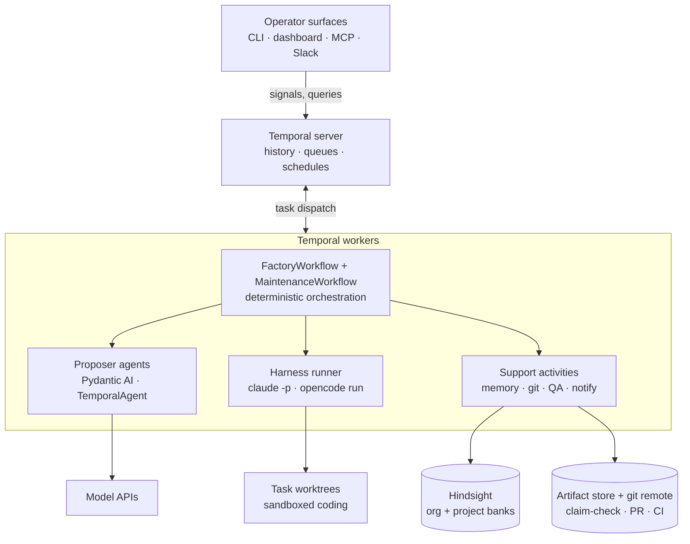
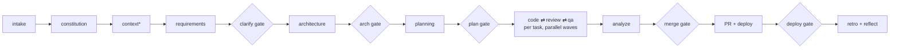
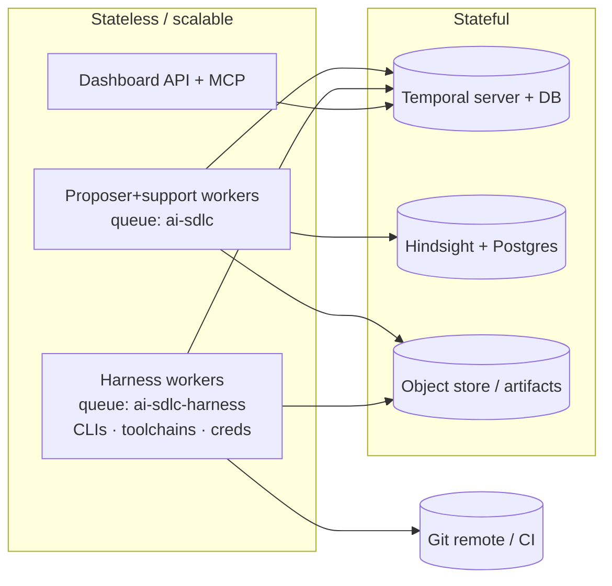

# Architecture — Agentic SDLC Factory

| | |
|---|---|
| Status | Draft v1.0 |
| Date | 2026-07-02 |
| Related | `PRD.md`, `SDLC-spec.md` (v2 + v2.1) — contracts in `src/factory/models/` are the source of truth |

---

## 1. Overview

The factory is a deterministic state machine over a fixed 14-stage DAG,
executed as a Temporal workflow. Specialized agents fill roles; humans hold
configurable decision gates; a shared memory makes the system learn across
runs; a proactive maintenance loop closes the circle from deployed feature
back to new work.

Two rules shape everything:

1. **The model never acts outside a sandboxed, observed boundary.**
   Proposer agents emit schema-validated artifacts and never touch tools.
   Coding harnesses act, but only inside risk-classed git worktrees, and
   only their diff is admitted as an artifact.
2. **Memory is I/O.** All memory access happens in activities; recall
   results become persisted, hashed `RecallSnapshot` artifacts declared as
   stage inputs — stages stay pure functions of hashed inputs.



Nothing below the worker reaches upward: worktrees, memory, and stores are
passive endpoints. A misbehaving harness influences orchestration only
through its validated diff artifact.

## 2. Component responsibilities

| Component | Owns | Never does |
|---|---|---|
| Temporal server | run state, event history, timers, signals, schedules, visibility | business logic |
| FactoryWorkflow | stage sequencing, gate waits, fix-loop bounds, budget counters | I/O, subprocesses, memory, nondeterminism |
| MaintenanceWorkflow | DAPER cycle, repair gating, child factory runs | direct code patches |
| Proposer agents | typed artifact proposals (Requirements … RepairPlan) | tool calls, file access |
| Harness runner activity | `claude -p` / `opencode run` execution, heartbeats, checkpoint commits, cost capture | leaving the worktree; choosing its own permissions |
| Support activities | Hindsight retain/recall/reflect, worktree/PR ops, test/lint/coverage runs, notifications | decision-making |
| Deterministic stages | constitution, quality gate, summary/export | LLM calls |
| Hindsight | world facts, experiences, mental models per bank | overriding validators or contracts |
| Artifact store | specs, diffs, reports, recall snapshots (claim-check) | — |
| Operator surfaces | rendering queries, sending signals | owning state (no interface DB) |

## 3. Pipeline architecture

Stage DAG (SDLC-spec v2 §1). One `FactoryWorkflow` per run; the code stage
fans out per-task child work in dependency-ordered parallel waves.


*context runs only in brownfield mode (Cartographer → `CodebaseMap`; the
Architect then produces a delta: added/modified/removed against real
modules). Greenfield skips it and the Architect owns stack + file tree.*

**Per-task loop (creator/verifier discipline):** at planning time, each
task's acceptance criteria are compiled into a frozen **Validation
Contract** — machine-checkable assertions defined before any code exists, so
correctness is measured against requirements rather than implementation
bias. Then: worktree + branch per task → harness session implements → tests
run → validators judge **against the contract**. Validators (Reviewer, QA
analyst) are *clean-context*: they receive task + contract + materialized
diff + test output, never the worker's session or self-reported narrative.
On failure the same harness session resumes with the issues (bounded,
default 2 review / 3 QA repairs) — but sessions carry a **resume bound and
context ceiling**: past either, the factory starts a fresh session seeded
with a structured handoff, because a compacted session has lost the
reasoning thread and is treated as failed. Exhaustion escalates to a human
task gate (accept / retry with guidance / quarantine). Every harness run
ends with a checkpoint commit, and every completed task emits a
`HandoffSummary` (what changed, decisions, open concerns) consumed by
subsequent tasks and the merge stage.

**Execution mode:** implementation defaults to **serial** — parallel
implementers make divergent design decisions even with worktree isolation
(worktrees prevent file collisions, not architectural inconsistency).
Projects may enable dependency-ordered `waves`; the planner declares
module/file overlap and overlapping tasks serialize regardless. Read-only
work (review, analysis) always parallelizes freely.

**Incremental re-runs:** each stage is memoized on
`hash(inputs + prompt file + model id + recall snapshot)`. Editing a prompt
or learning a new memory legitimately invalidates; anything else is a cache
hit.

## 4. Agent architecture

Agent classes map to Temporal constructs (this is a rule, not a convention):

| Class | Construct | Ours |
|---|---|---|
| Automation (one LLM call) | activity via TemporalAgent | Product, Clarifier, Architect, Planner, Analyst, QA analyst, quality-gate verdict, detector, repair planner |
| Long-running (tools, iteration) | heartbeating activity | Developer / Resolver / reviewer harness runs |
| Conversational | external client ↔ workflow signals/queries | operators via MCP/dashboard |
| Proactive | workflow (timer loop / Schedule) | MaintenanceWorkflow, nightly reflect |
| Routing | deterministic workflow branch | intake (greenfield / brownfield / repair) |

Agents are configuration (`config/agents.yaml`): role → kind
(proposer|harness), model, prompt file, memory policy (banks, filters,
top_k, retain kind). The loader builds Pydantic AI `Agent`s with declared
`output_type` and wraps proposers in `TemporalAgent` — model calls and tool
I/O offload to activities automatically. Constraints enforced at load:
agent/toolset names are Temporal activity names (rename = breaking change);
developer and reviewer must differ in harness or model family.

**Context engineering (handles, not walls of text):** agent context is
assembled from references and scoped extracts, never full artifact dumps —
the Developer gets its task, the relevant `CodebaseMap` slice, and contract
refs; the Clarifier never sees code; no agent sees another stage's raw
transcript. Each role declares a context budget in `agents.yaml`, enforced
at prompt assembly. This is the prompt-side counterpart of the claim-check
rule: history payloads stay small by reference, and agent reasoning stays
sharp by scope. High-volume exploration (the Cartographer walking a large
repo) uses programmatic access — tools that filter and extract — rather
than streaming the corpus through the context window.

**Model tiering per role:** capability-matched, configured per agent, cost
attributed per role per run (SC-7 feeds tiering decisions):

| Role | Capability need | Tier |
|---|---|---|
| Architect, Planner, repair planner | strategic reasoning | frontier reasoning model |
| Developer, Resolver | code fluency + tools | code-optimized (harness-native) |
| Reviewer, QA analyst | adversarial instruction-following | **different provider/family than developer** |
| Clarifier, detector, Cartographer triage | narrow classification/extraction | small fast model |

**Harness abstraction:** one protocol, two adapters.
`claude -p <prompt> --output-format json --allowedTools … --resume <sid>` and
`opencode run [-m provider/model] [-s sid] [--attach url] --format json
<prompt>`. Adapters normalize to `HarnessRunResult{session_id, exit_code,
summary, cost_usd, commit_sha}`. Sessions resume across fix-loop attempts,
preserving the agent's working context. Permissions live in native harness
config, not prompts.

## 5. Human-in-the-loop architecture

A gate is a durable signal wait with policy:

```
policy: hard  -> always wait for human
        soft  -> auto-approve iff proposal.confidence >= threshold
                 AND deterministic checks pass; else wait
        off   -> proceed
```

Mechanics: entering a gate publishes an entry to the `pending_decisions`
query, fires a notify activity (Slack/email with deep links, retried), and
parks on `wait_condition`. Signals (`submit_gate_decision`,
`answer_question`) are idempotent — first decision wins — so multiple
surfaces cannot conflict. Durable timers drive reminders, fallback-approver
escalation, and timeout policy (soft clarifications may auto-accept the
suggested answer; everything else times out to rejection/inaction). Every
decision records decider, identity, comments, timestamp in history, and is
retained to memory as learning signal.

Escalation is not a separate mechanism: fix-loop exhaustion, budget
exhaustion, and repair approvals all *enter a hard gate* using the same
contract, which is why they all appear in the same inbox on every surface.

## 6. Memory architecture

Hindsight, self-hosted (Postgres). Banks: `org` (cross-project) and
`project:<repo>`; per-agent views via metadata filters
(`{kind, agent, stage, run_id, task_id}`), not bank sprawl.

| Moment | Op | Content |
|---|---|---|
| before each agent stage | recall → `RecallSnapshot` | per agent's configured banks/filters; persisted, hashed, prompt-injected |
| stage success | retain | artifact summary (store holds the artifact) |
| fix-loop end | retain `kind=gotcha` | what failed, what fixed it |
| every gate decision | retain `kind=gate_feedback` | human approve/reject + comments |
| retro | reflect | consolidate run → mental models |
| nightly Schedule | reflect (org) | cross-project consolidation |

Guardrails: memory is advisory context — validators and contracts always
outrank it (hard rules live in code via "failures become validators";
memory learns the soft rules). Retains are fire-and-forget with retries and
a PII/secret scrub hook. Calibration: retro compares agent confidence
scores against human overrides and retains miscalibration, feeding threshold
tuning.

## 7. Maintenance loop (DAPER)

Per-project proactive workflow: wake on timer or `nudge` signal →
**Detect** (deterministic signal collection — CI, deploy health, quarantined
tasks, error budgets — then agent triage with a confidence floor) →
**Analyze** → **Plan** (`RepairPlan{confidence, actions[]}`) → confidence
gate (below threshold: notify + hard gate; timeout = inaction) →
**Execute** — `code_fix` actions start brownfield FactoryWorkflow children
(repairs go *through* the factory, never around it); ops actions
(rollback/restart/scale) run directly under risk classes → **Report**,
which is *re-verification*, not summary: detection re-runs on the repaired
scope and only a clean re-detect closes the incident; unresolved issues
reopen (bounded) or escalate. The full incident experience (symptom → root
cause → fix → verified outcome) is retained to memory. `continue_as_new`
bounds history.

## 8. Interfaces

All surfaces are stateless shells over three Temporal primitives — queries
(`status`, `stages`, `pending_decisions`), signals, visibility lists:

- **Dashboard** (FastAPI + single-page UI): fleet rail, 14-stage spine,
  decision inbox (accept-suggestion one-click, inline custom answers,
  approve/reject with comments). Auth via API-key flow + rate limit
  (fastapi-request-pipeline). 5 s polling v1; SSE later.
- **MCP server**: `list_runs, run_detail, decision_inbox, answer_question,
  decide_gate, start_feature` — any MCP client becomes an operator surface.
- **CLI**: same operations for scripting.
- **Temporal Web UI**: admin/debug (full history, retries) — linked, not
  rebuilt.

The workflow authors decision-card content (title, detail, suggested
answer); surfaces render verbatim. New gate types need zero UI changes.

## 9. Deployment topology



Two task queues split the fleet: lightweight proposer/support workers scale
on LLM throughput; heavy harness workers (harness CLIs, language toolchains,
repo credentials, worktree disk) scale on coding concurrency — and hold the
only credentials that can touch repos. Everything stateless is disposable;
backup surface = Temporal DB + Hindsight Postgres + object store.

## 10. Security & governance

- Worktree sandbox per task; generated code confined under `runs/<id>/`.
- Least-privilege harness tools pinned in native config; risk-classed
  actions: reads free, workspace writes checked, destructive denied →
  escalate.
- Secrets: never in prompts, history, or memory; scrub hook on retain;
  harness credentials only on harness workers.
- Budgets per run (steps, wall-clock, cost) — exhaustion escalates.
- Deterministic quality gate cannot be overridden by any agent, memory, or
  soft-gate policy (SC-5 invariant).
- Full audit: Temporal history + artifact store reconstruct every decision;
  exported to `events.jsonl` / `report.html`.
- **Prompt lifecycle:** prompts are managed, versioned assets in git — edit
  → offline eval against a golden-artifact regression suite → deploy. A
  prompt version change is a legitimate cache invalidation (it is in the
  memoization hash), never a silent behavior change. An external prompt/eval
  platform (e.g., Braintrust) can own this loop later; the seam is the
  prompt loader.
- **Trajectory harvesting (P5 seam):** Temporal history + artifacts +
  handoffs + gate decisions already constitute complete trajectories
  (actions, tool calls, costs, outcomes, human feedback). The observability
  export doubles as the extraction point for trajectory evaluation and,
  eventually, fine-tuning small models for narrow roles — production data
  becoming a proprietary asset without adding a collection system.

## 11. Failure modes

| Failure | Behavior |
|---|---|
| Worker crash mid-harness-run | heartbeat timeout → retry on another worker from last checkpoint commit |
| LLM/API outage | activity retry policies with backoff; run parks, no state lost |
| Human absent at gate | reminder timer → fallback approver → timeout policy |
| Fix loops exhausted | escalation gate (accept/retry-with-guidance/quarantine) |
| Quarantined task | dependents blocked, run fails cleanly with state preserved |
| Payload > limits | claim-check refs; oversized payloads rejected in code review by convention + runtime guard |
| Hindsight down | recalls degrade to empty snapshot (logged); retains retry in background — pipeline never blocks on memory |
| History growth (maintenance/long runs) | continue-as-new |
| Prompt edited mid-fleet | memoization hash invalidates only affected stages |

## 12. Architecture decision records

- **ADR-1 Temporal owns state** (not a custom manifest/event-log
  orchestrator). Durable timers, signals, retries, visibility for free; the
  v1 hand-rolled engine's ideas survive as workflow code; `events.jsonl`
  demoted to export. *Trade-off:* determinism discipline required in
  workflow code (enforced by import-linter).
- **ADR-2 Pydantic AI for proposers, harness CLIs for doers.** Typed,
  validated artifacts where thinking happens; full agentic tool use where
  code gets written. `TemporalAgent` gives durability without custom glue.
  *Trade-off:* two agent runtimes to operate.
- **ADR-3 `CodeArtifact` = files[] | diff_ref union.** Propose-mode for
  small/greenfield and test files; harness-mode (diff in worktree) for real
  iterative work. Downstream consumers see one materialized diff.
- **ADR-4 Gates as policy-driven durable signal waits** (hard/soft/off +
  confidence threshold). One mechanism serves approvals, questions,
  escalations, repairs — one inbox everywhere. *Trade-off:* calibrated
  confidence is a prompt-engineering liability → monitored via SC-6.
- **ADR-5 Hindsight as advisory memory with hashed recall snapshots.**
  Learning without sacrificing reproducibility or contract authority.
  *Trade-off:* extra artifact per stage; snapshot in cache key means memory
  churn reduces cache hits (accepted: correctness over cache rate).
- **ADR-6 Cross-harness review by construction.** Registry validator rejects
  same harness+family dev/reviewer. Structural, not prompt-based, defense
  against self-review collusion.
- **ADR-7 Repairs execute through the factory.** MaintenanceWorkflow starts
  brownfield children for code fixes; autonomy never bypasses gates.
- **ADR-8 Interfaces are stateless signal/query shells.** No interface DB;
  Temporal is the single source of run truth; surfaces cannot drift.
- **ADR-9 Two worker pools by capability.** Proposer vs. harness queues:
  independent scaling, credential isolation, cheap fleet economics.
- **ADR-10 Claim-check for all large payloads.** 2MB history limit as a
  design forcing-function; `ArtifactRef{kind, uri, sha256}` everywhere.
- **ADR-11 Deterministic DAG, deliberately — contra the "Bitter Lesson."**
  Current practice argues orchestration should live in prompts/skills so
  architectures improve with each model release. We adopt that *within*
  stages (agent behavior, registry config, prompts) and reject it *between*
  stages: an SDLC needs auditability, gates that cannot be reasoned around,
  and reproducible re-runs — properties only a fixed, deterministic DAG
  provides. *Trade-off:* pipeline shape changes require code + versioning
  discipline; accepted as the price of governance.
- **ADR-12 Contract-first validation with clean-context validators.**
  Validation Contracts freeze "done" before implementation; validators never
  see the worker's narrative or session. Correctness is measured against
  requirements, not implementation bias — the structural complement to
  ADR-6's cross-harness rule. *Trade-off:* planning gets heavier; contracts
  can be wrong — which is exactly what the plan gate reviews.
- **ADR-13 Serial-by-default implementation; context by reference.**
  Worktrees prevent file collisions, not design divergence, so
  implementation defaults to serial with declared-overlap serialization in
  wave mode; agent context is handles + scoped extracts with per-role
  budgets, and sessions are resume-bounded (fresh session + structured
  handoff past the ceiling — compaction is failure). *Trade-off:* lower
  throughput per run and stricter prompt-assembly plumbing, in exchange for
  design consistency and sustained reasoning quality over long runs.

## 13. Technology summary

| Concern | Choice | Notes |
|---|---|---|
| Orchestration | Temporal (OSS or Cloud) | Python SDK, pydantic data converter |
| Agent runtime | Pydantic AI + `pydantic-ai-slim[temporal]` | TemporalAgent wrapping |
| Coding harnesses | Claude Code (`claude -p`), OpenCode (`opencode run`) | adapter protocol; `--attach` to warm opencode serve |
| Memory | Hindsight (vectorize-io) + Postgres | banks + metadata filters |
| Artifacts | S3-compatible object store + git | claim-check |
| Dashboard API | FastAPI + fastapi-request-pipeline | API-key auth, rate limit |
| Chat surface | MCP (FastMCP server) | Claude/goose/IDE clients |
| Spec conventions | Spec Kit / OpenSpec formats | consumed, not reimplemented |
| Prompt evals / observability | git-versioned prompts + golden-artifact regression suite; external platform (e.g., Braintrust) optional later | seam = prompt loader; traces from Temporal history |

## 14. Repository layout

The top-level split mirrors the architecture layers, so file placement is
always answerable by "which layer owns it." The `workflows/` vs
`activities/` boundary is Temporal's determinism requirement and is enforced
by an import-linter rule: nothing under `workflows/` may import
`subprocess`, HTTP clients, the memory client, or the harness package.

```
agentic-sdlc/
├── PRD.md · ARCHITECTURE.md · SDLC-spec.md      # this document set
├── config/
│   ├── agents.yaml            # §2/§4: roles, kinds, models, context budgets, memory policies
│   ├── pipeline.yaml          # gates (policy + confidence threshold), execution mode,
│   │                          #   session bounds, budgets — per project
│   ├── harness/               # claude-settings.json, opencode.json (pinned permissions)
│   └── memory.yaml            # Hindsight URL, banks, scrub rules
├── prompts/                   # one file per role + _shared_rules.md; versioned assets
│                              #   (FR-806: edit → offline eval → deploy; in memo hash)
├── src/factory/
│   ├── models/                # §4-contracts — source of truth
│   │   ├── artifacts.py       #   Requirements … CodeArtifact(files|diff_ref),
│   │   │                      #   ValidationContract, HandoffSummary
│   │   ├── refs.py            #   ArtifactRef, RecallSnapshot
│   │   ├── gates.py           #   GateDecision, GatePolicy(+threshold)
│   │   ├── maintenance.py     #   MaintenanceConfig, DetectionReport, RepairPlan
│   │   ├── config.py          #   PipelineConfig(execution_mode, max_session_resumes), RoleConfig
│   │   └── validators.py      #   Kahn DAG check, delta-vs-CodebaseMap, union checks,
│   │                          #   cross-harness reviewer rule
│   ├── workflows/             # deterministic only (import-linted)
│   │   ├── factory.py         #   FactoryWorkflow: 14-stage DAG, scheduling (serial|waves
│   │   │                      #   + overlap serialization), handoff flow
│   │   ├── task.py            #   per-task loop: contract-first, resume-bounded sessions
│   │   ├── gates.py           #   signal-wait gate helper + pending_decisions publishing
│   │   ├── maintenance.py     #   DAPER loop (report = re-detect)
│   │   └── retro.py           #   scheduled reflect
│   ├── activities/            # all non-determinism
│   │   ├── harness.py         #   run_coding_task (heartbeats, checkpoint commits, cost)
│   │   ├── repo.py            #   clone, worktree, get_task_diff, PR
│   │   ├── qa.py              #   tests, coverage, lint
│   │   ├── memory.py          #   recall_snapshot, retain, reflect
│   │   ├── cartography.py     #   brownfield repo analysis (programmatic access)
│   │   ├── notify.py          #   Slack/email push with deep links
│   │   └── deploy.py
│   ├── harness/               # CodingHarness protocol; claude_code.py, opencode.py
│   ├── agents/                # loader.py (agents.yaml → TemporalAgent), deterministic.py
│   ├── memory/                # Hindsight client wrapper, scrub.py
│   ├── hooks/                 # risk classes, budgets
│   ├── observability/         # history → events.jsonl/report.html; trajectory export (P5)
│   ├── worker.py              # two queues: ai-sdlc, ai-sdlc-harness
│   └── cli.py
├── interfaces/
│   ├── dashboard/             # FastAPI api.py + static/index.html (§8)
│   ├── mcp/                   # FastMCP operator server (§8)
│   └── slack/                 # webhook → signals
├── deploy/                    # docker-compose (temporal, hindsight+pg, minio),
│                              #   Dockerfile.worker, Dockerfile.harness-worker (§9)
├── tests/
│   ├── unit/ · workflows/     # validators, parsers; time-skipping gate/signal tests
│   ├── integration/           # real Hindsight container
│   └── fakes/fake_harness.py  # deterministic claude/opencode stand-in for CI
└── runs/                      # runtime, gitignored: worktrees, artifacts, report.html
```

A reference implementation of the core loop (models, harness adapters,
FactoryWorkflow with contract-first task loop, dashboard, MCP server,
maintenance workflow) exists as the project skeleton; it uses a flattened
module layout and should be reorganized into the tree above as P1 hardening.
