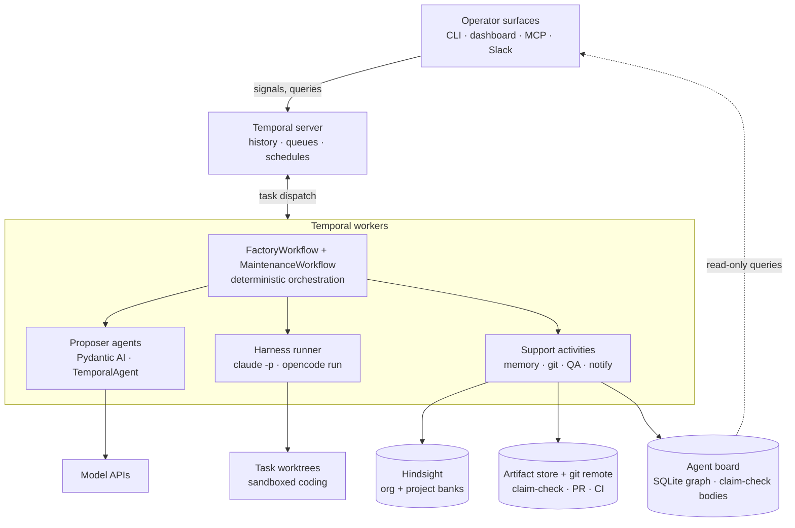
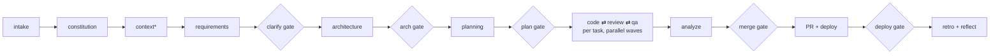
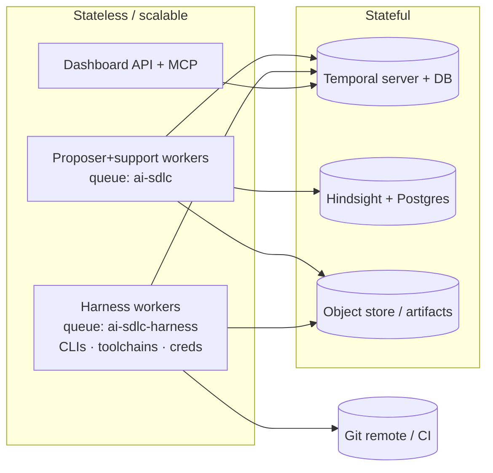

# Architecture — Agentic SDLC Factory

| | |
|---|---|
| Status | Draft v1.0 |
| Date | 2026-07-02 |
| Last amended | 2026-09-01 — the crew, a multi-agent code stage (§§2, 3, 4; E-88); §14 regenerated from `main`; §7 marked P4/unbuilt |
| Related | `PRD.md`, `SDLC-spec-v2.md`, `ROADMAP.md`, `BENCHMARK.md` — contracts in `src/sdlc/models.py` are the source of truth |

---

## 1. Overview

The factory is a deterministic state machine over a fixed 15-stage DAG,
executed as a Temporal workflow. Specialized agents fill roles; humans hold
configurable decision gates; a shared memory makes the system learn across
runs; a proactive maintenance loop closes the circle from deployed feature
back to new work.

Two rules shape everything:

1. **The model never acts outside a sandboxed, observed boundary.**
   Proposer agents emit schema-validated artifacts and never touch tools.
   Coding harnesses act, but only inside risk-classed git worktrees, and
   only their diff is admitted as an artifact.
2. **Memory is I/O.** All memory access happens in activities; recall
   results become persisted, hashed `RecallSnapshot` artifacts declared as
   stage inputs — stages stay pure functions of hashed inputs.



Nothing below the worker reaches upward: worktrees, memory, and stores are
passive endpoints. A misbehaving harness influences orchestration only
through its validated diff artifact.

## 2. Component responsibilities

| Component | Owns | Never does |
|---|---|---|
| Temporal server | run state, event history, timers, signals, schedules, visibility | business logic |
| FactoryWorkflow | stage sequencing, gate waits, fix-loop bounds, budget counters | I/O, subprocesses, memory, nondeterminism |
| MaintenanceWorkflow **(P4 — designed, not built)** | DAPER cycle, repair gating, child factory runs | direct code patches |
| Proposer agents | typed artifact proposals (Requirements … RepairPlan) | tool calls, file access |
| Harness runner activity | `claude -p` / `opencode run` execution, heartbeats, checkpoint commits, cost capture | leaving the worktree; choosing its own permissions |
| CrewTaskWorkflow (E-88) | the code stage's round loop when a task runs as a crew: turn order, the four brakes, per-round checkpoints, its own `tool_approval` / `crew_question` gates | subprocesses and file I/O (every turn is an activity); writing repository files through any role but the lead |
| Support activities | Hindsight retain/recall/reflect, worktree/PR ops, test/lint/coverage runs, notifications | decision-making |
| Deterministic stages | constitution, quality gate, summary/export | LLM calls |
| Hindsight | world facts, experiences, mental models per bank | overriding validators or contracts |
| Artifact store | specs, diffs, reports, recall snapshots (claim-check) | — |
| Agent board | project-level artifact versions + lineage, task status lifecycle, append-only change log | deciding anything; being the source of truth for what a run did |
| Operator surfaces | rendering queries, sending signals | owning state (no interface DB) |

## 3. Pipeline architecture

Stage DAG (SDLC-spec v2 §1). One `FactoryWorkflow` per run; the code stage
fans out per-task child work in dependency-ordered parallel waves.


*context runs only in brownfield mode (Cartographer → `CodebaseMap`; the
Architect then produces a delta: added/modified/removed against real
modules). Greenfield skips it and the Architect owns stack + file tree.*

**Per-task loop (creator/verifier discipline):** at planning time, each
task's acceptance criteria are compiled into a frozen **Validation
Contract** — machine-checkable assertions defined before any code exists, so
correctness is measured against requirements rather than implementation
bias. Then: worktree + branch per task → harness session implements → tests
run → validators judge **against the contract**. Validators (Reviewer, QA
analyst) are *clean-context*: they receive task + contract + materialized
diff + test output, never the worker's session or self-reported narrative.
On failure the same harness session resumes with the issues (bounded,
default 2 review / 3 QA repairs) — but sessions carry a **resume bound and
context ceiling**: past either, the factory starts a fresh session seeded
with a structured handoff, because a compacted session has lost the
reasoning thread and is treated as failed. Exhaustion escalates to a human
task gate (accept / retry with guidance / quarantine). Every harness run
ends with a checkpoint commit, and every completed task emits a
`HandoffSummary` (what changed, decisions, open concerns) consumed by
subsequent tasks and the merge stage.

**One session or a crew (E-88):** a task's implementation is by default one
harness session driven by an activity. It may instead run as a **crew** — a
`CrewTaskWorkflow` child holding a round loop, where a round is *lead turn →
critic turn → read the round's files → decide*. The round machine lives in
workflow code and every turn is an activity, so a lost worker costs one round
rather than a task: each round ends in a checkpoint commit. `HarnessKind.CREW`
is a **composition mode, not a CLI** — each role still names one of the real
harnesses — so the crew is selected per role config (`harness: crew`, `layout:
<name>`) and everything upstream and downstream of the stage is unchanged: the
child returns the same `HarnessRunResult` the single-session path returns.

**Execution mode:** implementation defaults to **serial** — parallel
implementers make divergent design decisions even with worktree isolation
(worktrees prevent file collisions, not architectural inconsistency).
Projects may enable dependency-ordered `waves`; the planner declares
module/file overlap and overlapping tasks serialize regardless. Read-only
work (review, analysis) always parallelizes freely.

**Integration by running branch (ADR-14):** worktrees isolate but do not
compose — a dependent task must *see* its predecessors' code, not just a
prose handoff. So each run holds one `sdlc/<run_id>/integration` branch,
created from `base` at run start, that accumulates completed task work. A
task branches from the *current integration head* (in wave mode, the head
frozen at wave start); on clean-context QA pass, an activity merges the task
branch back into integration. The merge-gate PR is `integration → base` —
resolving the parallel-branch/one-PR question (was OQ-2) as continuous
integration onto a run branch. Validator diffs anchor to the branch point,
not `base`, so a dependent task's diff shows only its own change. A wave-mode
merge conflict is a *falsified `overlaps` declaration* — now detectable →
serialize the loser or escalate. Integration fixes visibility, **not**
divergence; divergence remains serial-by-default's job.

**Incremental re-runs — auditability vs memoization (ADR-5):** two things
the specs used to conflate. *Auditability* is the invariant: persisted
artifacts, RecallSnapshots, and Temporal history reconstruct every run.
*Memoization* is a best-effort dev-loop optimization — re-running a fixed
idea after a prompt/config edit skips unchanged **upstream** stages (its ROI
is bounded: the expensive code stage is usually downstream of the edit and
re-runs anyway). Temporal gives none of this for free, so a `memoization`
module owns a content-addressed activity cache keyed on
`hash(activity + inputs + prompt file + model id + upstream recall snapshot ref)`,
backed by the artifact store (hash-named keys, no new infra). Recall is
itself a cached activity keyed with a **per-run memory watermark**: reusing
the persisted RecallSnapshot *is* the freeze, so nightly `reflect` churn no
longer busts caches. Default re-run reuses the watermark (reproducible,
cache-warm); an explicit "refresh memory" advances it. This also removes any
need for Hindsight point-in-time reads.

## 4. Agent architecture

Agent classes map to Temporal constructs (this is a rule, not a convention):

| Class | Construct | Ours |
|---|---|---|
| Automation (one LLM call) | activity via TemporalAgent | Product, Clarifier, Architect, Planner, Reviewer, Analyst, QA analyst, MergeVerdict, detector, repair planner |
| Long-running (tools, iteration) | heartbeating activity | Developer / Resolver harness runs; optional Reviewer *deep-review* tier |
| Conversational | external client ↔ workflow signals/queries | operators via MCP/dashboard |
| Proactive | workflow (timer loop / Schedule) | nightly reflect; MaintenanceWorkflow **(P4, unbuilt)** |
| Routing | deterministic workflow branch | intake (greenfield / brownfield / repair) |

Agents are configuration (`config/agents.yaml`): role → kind
(proposer|harness), model, prompt file, memory policy (banks, filters,
top_k, retain kind). The loader builds Pydantic AI `Agent`s with declared
`output_type` and wraps proposers in `TemporalAgent` — model calls and tool
I/O offload to activities automatically. Constraints enforced at load:
agent/toolset names are Temporal activity names (rename = breaking change);
developer and reviewer must differ in harness or model family.

**Context engineering (handles, not walls of text):** agent context is
assembled from references and scoped extracts, never full artifact dumps —
the Developer gets its task, the relevant `CodebaseMap` slice, and contract
refs; the Clarifier never sees code; no agent sees another stage's raw
transcript. Each role declares a context budget in `agents.yaml`, enforced
at prompt assembly. This is the prompt-side counterpart of the claim-check
rule: history payloads stay small by reference, and agent reasoning stays
sharp by scope. High-volume exploration (the Cartographer walking a large
repo) uses programmatic access — tools that filter and extract — rather
than streaming the corpus through the context window.

**Model tiering per role:** capability-matched, configured per agent, cost
attributed per role per run (SC-7 feeds tiering decisions):

| Role | Capability need | Tier |
|---|---|---|
| Architect, Planner, repair planner | strategic reasoning | frontier reasoning model |
| Developer, Resolver | code fluency + tools | code-optimized (harness-native) |
| Reviewer, QA analyst | adversarial instruction-following | **different model family than the developer's authoring model** |
| Clarifier, detector, Cartographer triage | narrow classification/extraction | small fast model |

**Harness abstraction:** one protocol, two adapters.
`claude -p <prompt> --output-format json --allowedTools … --resume <sid>` and
`opencode run [-m provider/model] [-s sid] [--attach url] --format json
<prompt>`. Adapters normalize to `HarnessRunResult{session_id, exit_code,
summary, cost_usd, commit_sha, input_tokens, output_tokens, context_window,
compacted, session_ref, session_digest}` — the token fields (already present in the harness
result JSON) make the ADR-13 context ceiling measurable rather than a blind
resume count. `session_ref: ArtifactRef{kind: harness_session}` is a
claim-checked, scrubbed **canonical `HarnessSession`** (normalised transcript
— tool-calls, file reads/writes, commands + exit status, model turns);
captured on every run (ADR-16), it is what makes *how* a diff was reached
measurable, not just the diff. `session_digest: SessionDigest` travels
**inline** (not claim-checked — it is small and bounded) carrying the §4.3
waste aggregates + decision-skeleton, computed pre-truncation so it exists
for every run including ones whose full transcript is later downgraded.
Green (first-pass) runs keep a structured
`SessionDigest` (waste aggregates + decision-skeleton) rather than the full
transcript; fail / benchmark / retried runs keep the full session (§4 waste
aggregates are computed pre-truncation, so they exist for every run). Sessions resume across fix-loop attempts,
preserving the agent's working context. Permissions live in native harness
config, not prompts.

**Reviewer is a clean-context proposer by default (ADR-6/ADR-12):** it emits
a typed `ReviewReport` from orchestrator-assembled inputs (materialized diff
+ frozen contract + test output + scoped `CodebaseMap` extracts) and holds no
tools, repo, or worker session — so it *cannot* wander or be polluted. The
doer has tools; the judge does not. A harness **deep-review** tier is
configurable per project/task for high-risk work; when enabled, the
harness-inequality clause re-applies to that path.

**The crew (E-88), when one harness session is not the unit of work.** A crew
is assets, not code: `crew/roles/<name>.yaml` declares a role's harness, model,
skill, and whether it `writes`; `crew/layouts/<name>.yaml` assembles roles with
a round bound, a deliverable, and limits. Three rules hold it together:

- **Exactly one role writes repository files, and it is the lead** — otherwise
  the diff stops being attributable to a role.
- **Every non-lead role differs in model family from the lead** (ADR-6, the
  reviewer rule applied to the crew). Checked when the crew loads and again in
  a client-side pre-flight; a model string carrying no provider separator is
  rejected, because family comparison would otherwise be meaningless.
- **A role's harness must be installed.** The worker refuses to boot on a crew
  whose CLI is missing, rather than discovering it one billed agent into a run.

**The fence is an argument, not a new predicate.** Non-lead roles keep `cwd` at
the worktree — a critic must read the code it is criticising — and set
`HarnessRequest.write_root` to their orchestration subtree, which becomes the
containment hook's confinement root. The shipped `no-out-of-worktree-write`
rule does the work unchanged. Its honest limit: that rule is hook-layer, so a
non-lead role on a harness with no hook layer is not confined by it and, under
`containment_strict`, refuses — which makes containment a statement about a
crew's *composition*.

**Round files are untrusted input.** Roles communicate through
`.workspace/orchestration/<layout>/round-N/`: `notes-v1` (the lead's
deliverable, which fills `HarnessRunResult.summary`), `advisor-v1` and
`review-v1` (the critic, read by the next round's brief), and `question-v1`
(any role, which raises a gate). Each is exact-schema and size-capped, an
unknown `schema` value is a hard error rather than a best-effort parse, and
contents are data — never instructions.

**A crew stops for a human without leaving the child.** `CrewTaskWorkflow` is
a `GateHost`, so a contained turn's `deferred` tool escalation and a role's
`question-v1` both become ordinary pending decisions answered by the existing
signals. Each carries `parent_run_id`, so the inbox groups a crew's gate under
the run it belongs to while the fleet view keeps listing runs, not children.
Four brakes bound the loop: wall clock, per-turn timeout, cost cap, and the
round bound, with a separate budget on escalations.

## 5. Human-in-the-loop architecture

A gate is a durable signal wait with policy:

```
policy: hard  -> always wait for human
        soft  -> auto-approve iff proposal.confidence >= threshold
                 AND deterministic checks pass; else wait
        off   -> proceed
```

A decision carries an **outcome ∈ {approve, reject, revise}** (not a bare
boolean): `approve` proceeds, `reject` is terminal, `revise` feeds `guidance`
back into the agent's next-round inputs. Revisable gates (clarify,
architecture, plan) run a **bounded revision loop**; exhaustion escalates to
a hard accept-anyway / abandon gate. This one contract collapses
architecture-revise, task-retry-with-guidance, and repair-approval into a
single shape (ADR-4).

Mechanics: entering a gate publishes an entry to the `pending_decisions`
query, fires a notify activity (Slack/email with deep links, retried), and
parks on `wait_condition`. Gate identity is `(gate_name, round)` so each
revision round is its own wait. Signals (`submit_gate_decision`,
`answer_question`) are idempotent — first decision *per round* wins — so
multiple surfaces cannot conflict and re-review is still possible. Durable timers drive reminders, fallback-approver
escalation, and timeout policy (soft clarifications may auto-accept the
suggested answer; everything else times out to rejection/inaction). Every
decision records decider, identity, comments, timestamp in history, and is
retained to memory as learning signal.

Escalation is not a separate mechanism: fix-loop exhaustion, budget
exhaustion, and repair approvals all *enter a hard gate* using the same
contract, which is why they all appear in the same inbox on every surface.

## 6. Memory architecture

Hindsight, self-hosted (Postgres). Banks: `org` (cross-project) and
`project:<repo>`; per-agent views via metadata filters
(`{kind, agent, stage, run_id, task_id}`), not bank sprawl.

| Moment | Op | Content |
|---|---|---|
| before each agent stage | recall → `RecallSnapshot` | per agent's configured banks/filters; persisted, hashed, prompt-injected |
| stage success | retain | artifact summary (store holds the artifact) |
| fix-loop end | retain `kind=gotcha` | what failed, what fixed it |
| every gate decision | retain `kind=gate_feedback` | human approve/reject + comments |
| retro | reflect | consolidate run → mental models |
| nightly Schedule | reflect (org) | cross-project consolidation |

Guardrails: memory is advisory context — validators and contracts always
outrank it (hard rules live in code via "failures become validators";
memory learns the soft rules). Retains are fire-and-forget with retries and
a PII/secret scrub hook. Calibration: retro compares agent confidence
scores against human overrides and retains miscalibration, feeding threshold
tuning.

## 7. Maintenance loop (DAPER)

> ⚠️ **Status: designed, not built (P4).** `MaintenanceWorkflow` does not
> exist —
> `grep -rniE "MaintenanceWorkflow|DetectionReport|RepairPlan|DAPER" src/ --include=*.py`
> returns nothing, and FR-501/502/503 are open. The section below is a
> *design*, written in present tense; read every sentence in it as "will".
> ROADMAP E-14 (the DAPER timer as a schedule asset) is explicitly blocked on
> this workflow existing at all, and three external-idea candidates (A4, B2,
> D1 in `docs/reports/external-ideas-2026-09.md`) land on it and are blocked with it.

Per-project proactive workflow: wake on timer or `nudge` signal →
**Detect** (deterministic signal collection — CI, deploy health, quarantined
tasks, error budgets — then agent triage with a confidence floor) →
**Analyze** → **Plan** (`RepairPlan{confidence, actions[]}`) → confidence
gate (below threshold: notify + hard gate; timeout = inaction) →
**Execute** — `code_fix` actions start brownfield FactoryWorkflow children
(repairs go *through* the factory, never around it); ops actions
(rollback/restart/scale) run directly under risk classes → **Report**,
which is *re-verification*, not summary: detection re-runs on the repaired
scope and only a clean re-detect closes the incident; unresolved issues
reopen (bounded) or escalate. The full incident experience (symptom → root
cause → fix → verified outcome) is retained to memory. `continue_as_new`
bounds history.

## 8. Interfaces

*Operator* surfaces are stateless shells over three Temporal primitives —
queries (`status`, `stages`, `pending_decisions`), signals, visibility lists.
The **agent board API** (E-78, ADR-21) and the **dashboard backend** (E-10) are
the two deliberate exceptions: the board serves durable cross-run state that no
live workflow holds, so it reads its own store rather than a running workflow,
while the dashboard backend holds an in-process fleet poller and subscriber
set — not durable state, but not a stateless shell either. The poller exists
because a per-request fan-out costs `N_clients × N_runs` while one shared
poller costs `N_runs`. Operator surfaces still own no durable state.

- **Dashboard** (FastAPI + single-page UI): fleet rail, 15-stage spine,
  decision inbox (accept-suggestion one-click, inline custom answers,
  approve/reject with comments). Auth via API-key flow + rate limit
  (fastapi-request-pipeline). Serves an SSE stream (`/api/events`) from a
  shared lazy poller (E-10); no client polling.
- **MCP server**: `list_runs, run_detail, decision_inbox, answer_question,
  decide_gate, start_feature` — any MCP client becomes an operator surface.
- **CLI**: same operations for scripting.
- **Agent board API** (FastAPI, `sdlc/board/api.py`): the machine-facing
  surface. Reads — projects, artifact versions with lineage and content, tasks
  filtered by status, the event log, board counters. Writes — exactly two
  routes (`POST …/claim`, `PATCH …/{task_id}`), both requiring `If-Match:
  <row_version>`, both **observational**: they move the live view, never
  `authoritative_status`. Serves agents first; the dashboard is a secondary
  consumer.
- **Temporal Web UI**: admin/debug (full history, retries) — linked, not
  rebuilt.

The workflow authors decision-card content (title, detail, suggested
answer); surfaces render verbatim. New gate types need zero UI changes.

## 9. Deployment topology



Two task queues split the fleet: lightweight proposer/support workers scale
on LLM throughput; heavy harness workers (harness CLIs, language toolchains,
repo credentials, worktree disk) scale on coding concurrency — and hold the
only credentials that can touch repos, repo-scoped and short-lived. Each
harness run is contained per the §10 tier (restricted OS user at P1,
container at fleet scale). Everything stateless is disposable;
backup surface = Temporal DB + Hindsight Postgres + object store.

## 10. Security & governance

- **Harness containment, tiered — a worktree is not a sandbox** (same host,
  FS, and env; it prevents file collisions, not escape). P1: harness runs as
  a restricted OS user with FS ACLs (worktree-only) + egress policy. Fleet
  scale: container per run (rootless, read-only base FS, worktree bind-mount
  rw, egress-restricted). Generated code confined under `runs/<run_id>/`.
- **Env allowlist, not passthrough:** the harness subprocess receives a
  curated env (PATH, HOME, toolchain vars) + deliberately-injected,
  repo-scoped, short-TTL credentials only — never the worker's full
  environment. The env is a larger secret channel than prompts.
- **Risk classing lives in the `pre_tool` hook, not `--allowedTools`** (too
  coarse to express "reads free / writes checked / destructive denied"): the
  hook inspects the concrete command and denies/escalates out-of-worktree
  writes, `rm -rf`, and non-allowlisted network. Egress is restricted to the
  model API + git remote.
- Secrets: never in prompts, history, or memory; scrub hook on retain;
  harness credentials only on harness workers, repo-scoped and short-lived.
- Budgets per run (steps, wall-clock, cost) — exhaustion escalates.
- **`DeterministicQualityGate` decides on typed evidence; `MergeVerdict`
  (LLM) only advises the soft merge path and only on an already-passing
  build.** Checks are classed *absolute* (lint, no critical security finding,
  build/integration integrity — never overridable) or *advisory* (coverage,
  traceability completeness, non-critical severity — human-overridable with
  recorded justification, retained as calibration). SC-5: **zero deploys past
  a failed absolute check; zero *unattended* deploys past any failed check.**
  No agent, memory, or soft-gate policy overrides any check.
- Full audit: Temporal history + artifact store reconstruct every decision;
  exported to `events.jsonl` / `report.html`.
- **Prompt lifecycle:** prompts are managed, versioned assets in git — edit
  → offline eval against a golden-artifact regression suite → deploy. A
  prompt version change is a legitimate cache invalidation (it is in the
  memoization hash), never a silent behavior change. An external prompt/eval
  platform (e.g., Braintrust) can own this loop later; the seam is the
  prompt loader. **Status:** the offline-eval half exists today — the
  benchmark harness (`benchmarks/workflow.py`, E-27) and `sdlc eval`
  loop (E-4) judge per-stage artifacts with the cross-family judge. The
  design that folds them into an SC-1..6 measurement instrument —
  held-out oracles, per-role economics, the `case × stage` error
  heatmap — is `docs/BENCHMARK.md` (ROADMAP §9.8, E-30…E-37).
- **Trajectory harvesting (P5 seam):** Temporal history + artifacts +
  handoffs + gate decisions already constitute complete trajectories
  (actions, tool calls, costs, outcomes, human feedback). The observability
  export doubles as the extraction point for trajectory evaluation and,
  eventually, fine-tuning small models for narrow roles — production data
  becoming a proprietary asset without adding a collection system.

## 11. Failure modes

| Failure | Behavior |
|---|---|
| Worker crash mid-harness-run | heartbeat timeout → retry on another worker from last checkpoint commit |
| LLM/API outage | activity retry policies with backoff; run parks, no state lost |
| Human absent at gate | reminder timer → fallback approver → timeout policy |
| Fix loops exhausted | escalation gate (accept/retry-with-guidance/quarantine) |
| Quarantined task | dependents blocked, run fails cleanly with state preserved |
| Payload > limits | claim-check refs; oversized payloads rejected in code review by convention + runtime guard |
| Hindsight down | recalls degrade to empty snapshot (logged); retains retry in background — pipeline never blocks on memory |
| History growth (maintenance/long runs) | continue-as-new |
| Prompt edited mid-fleet | memoization hash invalidates only affected stages |

## 12. Architecture decision records

- **ADR-1 Temporal owns state** (not a custom manifest/event-log
  orchestrator). Durable timers, signals, retries, visibility for free; the
  v1 hand-rolled engine's ideas survive as workflow code; `events.jsonl`
  demoted to export. *Trade-off:* determinism discipline required in
  workflow code (enforced by import-linter).
- **ADR-2 Pydantic AI for proposers, harness CLIs for doers.** Typed,
  validated artifacts where thinking happens; full agentic tool use where
  code gets written. `TemporalAgent` gives durability without custom glue.
  *Trade-off:* two agent runtimes to operate.
- **ADR-3 `CodeArtifact` = files[] | diff_ref union.** Propose-mode for
  small/greenfield and test files; harness-mode (diff in worktree) for real
  iterative work. Downstream consumers see one materialized diff.
- **ADR-4 Gates as policy-driven durable signal waits** (hard/soft/off +
  confidence threshold). A decision's outcome is `{approve, reject, revise}`,
  and gate identity is `(gate_name, round)` so `revise` loops back
  (bounded) while idempotency holds per round. One mechanism serves
  approvals, questions, escalations, repairs, *and revisions* — one inbox
  everywhere. *Trade-off:* calibrated confidence is a prompt-engineering
  liability → monitored via SC-6.
- **ADR-5 Hindsight as advisory memory; auditability vs memoization split.**
  Auditability (persisted artifacts + snapshots + history) is the invariant;
  memoization is a best-effort dev-loop cache. A per-run memory watermark
  pins recall — reusing the persisted snapshot *is* the freeze — so memory is
  refreshed on purpose, not busted by nightly `reflect`. *Trade-off:* extra
  artifact per stage; the memoization module and watermark are real (if
  small) components Temporal does not provide.
- **ADR-6 Anti-collusion review by construction.** The real invariant is
  *different model family than the developer's authoring model*; the reviewer
  is a clean-context proposer (no tools/repo/session) by default, so the doer
  has tools and the judge does not. The registry validator enforces
  model-family inequality. **Precise boundary for sessions (ADR-16):** the
  default `review` starts from a clean context and **never resumes the
  developer's session**; the optional, opt-in `deep_review` tier (ROADMAP
  E-39) reads the **scrubbed** `HarnessSession` as *data* (never the raw
  session, never via resume-handle), stays ADR-6 family-independent of the
  developer, and is an **additional** decorrelated lens, not a replacement
  for clean-context review — so it additionally rejects same harness+family.
  Default review starts clean and never resumes the developer's session. The
  optional `deep_review` tier (FR-111/E-39) reads the *scrubbed* HarnessSession
  as data — never the raw session, never via resume-handle — is ADR-6
  family-independent of `dev`, and is advisory-only: an additional lens, never a
  replacement for the clean-context reviewer.
  Structural, not prompt-based.
- **ADR-7 Repairs execute through the factory.** MaintenanceWorkflow starts
  brownfield children for code fixes; autonomy never bypasses gates.
- **ADR-8 Interfaces are stateless signal/query shells.** No interface DB;
  Temporal is the single source of run truth; surfaces cannot drift.
- **ADR-9 Two worker pools by capability.** Proposer vs. harness queues:
  independent scaling, credential isolation, cheap fleet economics.
- **ADR-10 Claim-check for all large payloads.** 2MB history limit as a
  design forcing-function; `ArtifactRef{kind, uri, sha256}` everywhere.
- **ADR-11 Deterministic DAG, deliberately — contra the "Bitter Lesson."**
  Current practice argues orchestration should live in prompts/skills so
  architectures improve with each model release. We adopt that *within*
  stages (agent behavior, registry config, prompts) and reject it *between*
  stages: an SDLC needs auditability, gates that cannot be reasoned around,
  and reproducible re-runs — properties only a fixed, deterministic DAG
  provides. *Trade-off:* pipeline shape changes require code + versioning
  discipline; accepted as the price of governance.
- **ADR-12 Contract-first validation with clean-context validators.**
  Validation Contracts freeze "done" before implementation; validators never
  see the worker's narrative or session. Correctness is measured against
  requirements, not implementation bias — the structural complement to
  ADR-6's cross-harness rule. *Trade-off:* planning gets heavier; contracts
  can be wrong — which is exactly what the plan gate reviews.
- **ADR-13 Serial-by-default implementation; context by reference.**
  Worktrees prevent file collisions, not design divergence, so
  implementation defaults to serial with declared-overlap serialization in
  wave mode; agent context is handles + scoped extracts with per-role
  budgets, and sessions are resume-bounded (fresh session + structured
  handoff past the ceiling — compaction is failure). The ceiling is
  *measured*: `input_tokens > fraction × context_window` (from the harness
  result JSON), with `max_session_resumes` as a hard fallback — not a blind
  resume count. *Trade-off:* lower throughput per run and stricter
  prompt-assembly plumbing, in exchange for design consistency and sustained
  reasoning quality over long runs.
- **ADR-14 Integration by running branch.** Worktrees isolate but do not
  compose; a `sdlc/<run_id>/integration` branch accumulates completed task
  work, tasks branch from its head, and merge back on QA pass. The merge PR
  is `integration → base` (resolves the old OQ-2). Validator diffs anchor to
  the branch point; a wave-mode merge conflict is a falsified `overlaps`
  declaration → serialize or escalate. *Trade-off:* integration fixes
  visibility, not divergence (still serial-by-default's job); adds a
  merge-back activity and run-scoped worktree paths.
- **ADR-15 Toolchain adapters for language-agnostic evaluation.** Generated
  projects are not one language, so the stage-11/12 quality activities
  (`run_test_suite`, `run_lint`, `security_scan`, `measure_coverage`) cannot
  hardcode one toolchain. A `ToolchainAdapter` registry (`TOOLCHAINS`, beside
  `HARNESSES`) resolves **by marker file in the produced repo**
  (`pyproject.toml`/`package.json`/`go.mod`/`Cargo.toml` — the built artifact
  decides, not the Architect's stated stack) and normalises
  `build()/test()/lint()/coverage()` into the existing `TestReport`. Two format
  invariants keep the deterministic gate language-agnostic and *unchanged*:
  canonical coverage is **Cobertura XML** (each adapter translates into it;
  `measure_coverage` already reads `coverage.xml`), and the absolute security
  floor is **semgrep → SARIF** (one multi-language tool, so `security_no_critical`
  / SC-5 stays a single check, not per-language sprawl). This is the exact
  shape of ADR-2/3's harness adapter, applied to the evaluation toolchain:
  adding a language is adding an adapter, never a fork. Rollout is incremental
  — one reference adapter (Python) proves the seam end-to-end; further languages
  are added on demand as the benchmark corpus needs them (ROADMAP §9.8,
  E-30/E-30a-c). *Trade-off:* a new abstraction and registry to maintain, and a
  per-language translation shim, in exchange for a grade that holds across every
  language the factory can emit. **New scope** vs a Python-only pipeline —
  likely a PRD line for the multi-language capability, not only this ADR.
  *2026-08-08 (E-41a–d):* the adapter gains its first pure per-language
  **parser** member, `function_spans`, beside its command strings. It runs no
  subprocess and touches no filesystem, so ADR-15's purity rule holds; it is
  the same kind of member as `classify_test_exit` — a per-language
  interpretation rather than a command. Framework fingerprints and
  misconfiguration rules deliberately do **not** live here: one language
  serves many frameworks.
- **ADR-16 Harness sessions as first-class, claim-checked artifacts.**
  Every harness run emits a canonical `HarnessSession` — a normalised
  transcript (tool-calls, file reads/writes, commands + exit status, model
  turns) — as `session_ref: ArtifactRef{kind: harness_session}` on
  `HarnessRunResult` (§4). Normalising the transcript is the **harness
  adapter's** responsibility, beside the resume-handle it already owns
  (`claude --resume` / `opencode -s`) — same registry and pattern as the
  toolchain adapter (ADR-15). Because capture is **always-on**, three
  properties are hot-path invariants, not options: claim-check is
  unconditional (transcripts are large, never touch workflow state — the
  second reason FR-702 must close, beside diffs); the memory scrub
  (`pre_retain`) runs over the session **before** storage, **fail-closed**
  like the SC-5 security floor (an injected credential in an always-stored
  transcript is a leak by default); and retention follows a decided policy —
  full transcript on fail / benchmark / any run with >0 fix-loop attempts, a
  structured `SessionDigest` (§4.3 waste aggregates + decision-skeleton,
  computed pre-truncation and always kept) on clean-green runs, never a blind
  byte-truncation; scrub runs fail-closed **before** the full-vs-digest
  branch, so a scrub failure stores nothing either way (full-transcript TTL
  is the one open sub-point, OQ-B7). The session is the concrete **P5 trajectory
  seam** (§10): most of what `events.jsonl`/`report.html` render and the
  extraction point for trajectory eval + small-model distillation. Consumers
  are the offline benchmark/anti-cheat, the opt-in `deep_review` lens
  (ADR-6, E-39), trajectory harvesting, and retro distillation into memory —
  **never** the default clean-context reviewer (ADR-6). *Trade-off:* a
  storage + scrub cost on every run, in exchange for making agent behaviour
  (not just its output diff) a first-class, measurable signal. **New scope.**
- **ADR-17** Containment as a declared harness capability — a `CodingHarness`
  declares which layers it can enforce (`native` / `hook`); the policy is one
  versioned asset (`policy/containment.yaml`) compiled per adapter. Native
  config is the **inner** layer and the hook the outer one, which is
  structural rather than conventional: a hook's `allow` cannot bypass a
  `permissions.deny` rule (verified against claude 2.1.219). Because a native
  denial is **not** structurally reported (`permission_denials` is empty for
  it) while a hook denial is, `layer:` declares a rule's *minimum* capability
  and each adapter enforces at every layer it has. Total absence of layers
  fails closed (cursor); partial coverage is recorded in `ContainmentReport`,
  never silent; `strict` promotes partial coverage to a refusal. The hook
  (`python -m sdlc.harness.hook`) is its own import-light module — it runs
  once per tool call and must not import Temporal/pydantic_ai — and receives
  the policy path explicitly (`--policy`), because its cwd is the task
  worktree (a temp dir) where repo-root discovery would fail. **Adapter
  reality (unequal mechanisms):** claude compiles to `permissions.deny` +
  `hooks.PreToolUse` (full, observable); opencode (1.18.4) has no config flag
  and no config env var, so its native deny is written into the worktree's
  own `opencode.json` — self-protecting via the `edit` deny the same
  compilation emits for agent-config paths; cursor surfaces neither and fails
  closed. **This is a fence, not a sandbox:** egress denial is tool-level only
  (a socket opened inside an allowed `Bash` call is invisible); the
  OS-user/container tier is E-21.
- **ADR-18** Triage precedes capability modelling — a repository that does not
  build, or whose structure is not discernible, is **not** capability-mapped;
  the factory reports the precondition as unmet (FR-903) instead of emitting a
  low-confidence model. The forcing case is the repository class the assessment
  product exists for: the EDCR methodology is enterprise-brownfield machinery
  (BIAN / TM Forum / ACORD / HL7 blueprints), and against a three-week-old
  vibe-coded repo its ≥90% file→capability coverage has nothing to map to,
  every QA composite degenerates to `unknown`, and per-capability STRIDE
  reasoning is paid for over structure that does not exist. So Tier 0 triage
  (FR-900) is a distinct, cheaper, deterministic tier that **gates** Tier 2
  (FR-910) rather than a first pass of it. *Trade-off:* two artifact families
  and two workflows instead of one, in exchange for never shipping a
  confident-looking capability model derived from absent structure — a wrong
  answer here is not a weaker audit, it is a misleading one. **New scope.**
- **ADR-19** Deployment targets and product-analytics sources are **adapters,
  not substrate** — resolved from configuration exactly as toolchains are
  (ADR-15), with one reference adapter each and no hosting, feature-flagging,
  or analytics implementation of our own (NG7). This is what keeps the
  product-outcome loop (FR-1100) an adjacent capability rather than a second
  product: what remains after the substrate is excluded is a frozen contract, a
  traceability check, a durable timer, and a gate — all mechanisms this system
  already has. *Trade-off:* the factory's verdict depends on a metric read from
  a system it does not control, which is FR-914's grounding problem outside our
  trust boundary and is recorded unresolved as **OQ-9**. **New scope.**
- **ADR-20** Pre-registration reuses contract-freeze semantics — an
  experiment's decision rule is frozen and hashed at the hypothesis gate
  precisely as `ValidationContract` freezes at planning (FR-803), and a
  post-hoc change is a new audited gate round retaining both versions, never a
  silent rewrite. One freeze mechanism, one audit shape, and the property that
  carries the value (the rule cannot be edited once the data is visible) is
  inherited rather than reinvented. *Trade-off:* rigidity is the point — an
  owner who genuinely learns something mid-window must pay an audited round to
  act on it, which is the cost of the guarantee. **New scope.**

  *Extended 2026-07-25 (E-17):* the same hook carries approval, not only
  denial. claude's `permissionDecision: "defer"` suspends the call and ends
  the print-mode run, so the durable wait lives in the workflow's existing
  gate rather than in an activity awaiting a signal. `defer` is print-mode
  only and **solo-only** — a defer emitted for a batched call is discarded
  and the call falls through to `acceptEdits` — so the hook counts sibling
  tool_use blocks and denies when it cannot guarantee a solo defer.
  Degradation is always toward deny.

- **ADR-21 The agent board is a durable projection, never a second source of
  truth.** Typed stage artifacts (`ClarifiedRequirements`, `ArchitectureSpec`,
  `ImplementationPlan`, `DevTask[]`) previously existed only in Temporal
  history, so "what design did run X propose?" required a replay and nothing
  could carry a *status*. The board makes them addressable: immutable bodies in
  the claim-check store, a mutable graph in SQLite, versioned per project with
  lineage across runs. Agents may move task status; the workflow alone writes
  `authoritative_status`. **That split is the whole design.** Statistics,
  scoring, and any human reading "what happened" consume
  `authoritative_status` only, so an agent that crashes mid-claim,
  double-claims, or reports optimistically corrupts the live view and nothing
  else — Temporal history still reconstructs the run, preserving §12's
  auditability invariant. Divergence between the two columns is itself a
  surfaced signal. Storage splits on the mutable/immutable line because they
  have different needs: bodies want content addressing (sha256, already built
  for ADR-16), state wants transactions. SQLite supplies serialization from the
  standard library — `BEGIN IMMEDIATE` plus a `row_version` compare-and-swap is
  what makes two agents racing for one task yield one winner and one `409`.
  *Rejected:* a git-backed board in the target repo (most reviewable, but status
  churn becomes merge conflicts and every claim is a commit) and extending
  Hindsight (already project-scoped, but a semantic recall system has no state
  machine and no compare-and-swap). *Trade-off:* one SQLite file is correct for
  a single worker container and must become Postgres before a second one — the
  same threshold at which `server start-dev` has to go. **New scope.**

  *Idempotency is a load-bearing requirement, not a nicety.* Temporal executes
  activities at least once: an activity that commits and then loses its worker
  before reporting completion is re-run. Board writes must therefore absorb
  re-execution — a repeated terminal transition is a no-op returning the
  current row, not an `InvalidTransition`, because the latter fails identically
  on every retry and turns a transient worker blip into a permanently failed
  run.

  *Deferred, deliberately:* replacing the deterministic pipeline with an LLM
  scheduler that reads the board and dispatches. Externalizing state is what
  makes dynamic task graphs, resume, and re-entry possible, and Temporal can
  read the board and dispatch without surrendering replay. Building the
  orchestrator on top later means it can be *measured* against the workflow
  rather than adopted on faith; adopting it now would trade replay,
  gate semantics, and benchmark signal-to-noise for flexibility already
  obtained.

## 13. Technology summary

| Concern | Choice | Notes |
|---|---|---|
| Orchestration | Temporal (OSS or Cloud) | Python SDK, pydantic data converter |
| Agent runtime | Pydantic AI + `pydantic-ai-slim[temporal]` | TemporalAgent wrapping |
| Coding harnesses | Claude Code (`claude -p`), OpenCode (`opencode run`) | adapter protocol; `--attach` to warm opencode serve |
| Memory | Hindsight (vectorize-io) + Postgres | banks + metadata filters |
| Artifacts | S3-compatible object store + git | claim-check |
| Agent board | SQLite (WAL, `BEGIN IMMEDIATE`) for the mutable graph; claim-check store for bodies | stdlib, no new infra; Postgres is a second backend behind `BoardStore` at the same threshold `server start-dev` must go |
| Dashboard API | FastAPI + fastapi-request-pipeline | API-key auth, rate limit |
| Chat surface | MCP (FastMCP server) | Claude/goose/IDE clients |
| Spec conventions | Spec Kit / OpenSpec formats | consumed, not reimplemented |
| Prompt evals / observability | git-versioned prompts + golden-artifact regression suite; external platform (e.g., Braintrust) optional later | seam = prompt loader; traces from Temporal history |

## 14. Repository layout

**Regenerated from `main` 2026-09-01.** The previous version of this section
was a *design* tree that had drifted from the repository it claimed to
describe: it named `src/factory/` (the package is `src/sdlc/`), `models/` and
`activities/` as packages (both are single modules), `workflows/factory.py`
(it is `feature.py`), `harness/claude_code.py` (it is `adapters.py`), and a
`config/` directory that does not exist — while omitting roughly twenty real
packages. What follows is the tree as it is; annotations say what each part
owns.

The `workflows/` vs everything-else split is Temporal's determinism
requirement: workflow modules may not do I/O, and reach non-deterministic code
only through activities or an explicit
`with workflow.unsafe.imports_passed_through():` block. That rule is enforced
at runtime by Temporal's workflow sandbox — there is no import-linter in this
repo, and a violation surfaces as a sandbox error, not a lint failure.

```
Kroker/
├── PRD.md · ARCHITECTURE.md · ROADMAP.md · BENCHMARK.md · SDLC-spec-v2.md
├── agents/                    # §2/§4: 17 role folders (E-1/E-2, "agents as folders")
│   ├── registry.yaml          #   role → kind, harness/model, prompts, memory policy
│   └── <role>/                #   agent.yaml + instructions.md, versioned as assets
│                              #   clarify · architect · planner · dev · reviewer · qa ·
│                              #   analyst · adversary · deep_review · merge_verdict ·
│                              #   research · risk · discover · handoff · test ·
│                              #   devops · devops_planner
├── crew/                      # §4: the multi-role code stage (E-88)
│   ├── layouts/code.yaml      #   which roles assemble, round bound, deliverable, limits
│   ├── roles/*.yaml           #   coder (lead, writes) · critic (non-writing, other vendor)
│   └── skills/<role>/SKILL.md #   each role's round protocol
├── policy/                    # containment.yaml (hook + native rules), notifications.yaml
├── schedules/                 # nightly-reflect.yaml → Temporal Schedules (E-12/E-13)
├── blueprints/                # apqc.yaml — process taxonomy for assessment
├── benchmarks/cases/<case>/   # §9.8 golden cases: feature spec, rubrics, oracle/
├── src/sdlc/
│   ├── models.py              # THE contract module: artifacts, gates, config, harness
│   │                          #   results, HarnessKind, PipelineConfig — source of truth
│   ├── activities.py          # the main non-deterministic surface: harness runs, git,
│   │                          #   worktrees, tests, PRs, containment resolution
│   ├── workflows/             # deterministic only (Temporal sandbox)
│   │   ├── feature.py         #   FeatureWorkflow — the 15-stage DAG, gates, fix loops
│   │   ├── crew.py            #   CrewTaskWorkflow (E-88) — the round loop + brakes
│   │   ├── gates.py           #   GateHost — signal-wait gates + pending publication
│   │   ├── fanout.py          #   clarify probe fan-out (E-85)
│   │   ├── deployment.py      #   stage-13 child: apply → smoke → rollback (E-67)
│   │   ├── assessment.py · scanning.py · triage.py · tidyup.py   # Tier 0/2 (E-40…E-56)
│   │   └── reflect.py         #   scheduled reflect (E-13)
│   ├── crew/                  # E-88: config.py, loader.py, models.py, activities.py,
│   │                          #   worktree.py — roles/layouts as files, the round's I/O
│   ├── harness/               # adapters.py (claude_code · opencode · cursor + registry),
│   │                          #   containment.py (policy → predicates), hook.py, session.py
│   ├── agents/                # registry loader → pydantic-ai Agent / TemporalAgent
│   ├── memory/                # Hindsight client + protocol, scrub, query hashing
│   ├── memoization/           # content-addressed activity cache (ADR-5)
│   ├── artifacts/             # claim-check store, capture, read, retention
│   ├── board/                 # ADR-21: artifact versions, task lifecycle, events, API
│   ├── benchmarks/            # eval harness: judge, scoring, sc_rollup, drift, oracle,
│   │                          #   the matrices (error/task/waste/agreement), importers/
│   ├── assessment/            # Tier 2 EDCR: scan/ signals, discover/, risk/
│   ├── triage/                # Tier 0: admission, signals/, delta, advisories
│   ├── capability/            # CapabilityMap identity, fingerprint, corrections (E-47)
│   ├── context/               # brownfield: classify, CodebaseMap, delta, render
│   ├── clarify/               # MAC-style probe fan-out + deterministic merge (E-85)
│   ├── research/              # grounded briefs: toolset, tavily, verify, budget (FR-107)
│   ├── channels/              # contract.py, transport.py, inbox.py — one channel
│   │                          #   abstraction behind every surface (E-6/E-7/E-8, ADR-8)
│   ├── dashboard/             # fleet poller, REST + SSE api, channel adapter (E-10)
│   ├── operator/              # chat agent's tool layer — 12 verbs (E-86)
│   ├── notify/                # routes, schedule, notifiers, render (E-9)
│   ├── observability/         # trace, export (events.jsonl/report.html), usage, logfire
│   ├── eval/                  # promptfoo prompt gate + verdicts (E-82)
│   ├── deploy/ · toolchain/ · schedules/ · tidyup/
│   ├── gate.py                # DeterministicQualityGate + ABSOLUTE_FLOOR
│   ├── pending.py             # PendingDecision — the four gate variants
│   ├── handoff.py · grounding.py · measurement.py · pricing.py · naming.py · prompts.py
│   ├── worker.py              # queues ai-sdlc / ai-sdlc-harness; registers everything
│   └── cli.py · cli_roles.py
├── interfaces/
│   ├── dashboard/api/main.py  # composes the board + dashboard routers (+ /chat)
│   ├── dashboard/frontend/    # Vue 3 SPA against the live API
│   └── chat/                  # operator chat agent assets (E-86)
├── tests/                     # ~466 files, flat; fakes/ and fixtures/ beneath
│                              #   markers: slow · temporal · live · docker · crew ·
│                              #   prompt_eval, all deselected by default addopts
├── docs/superpowers/{specs,plans}/   # one design doc + one plan per epic
├── Dockerfile · docker-compose.yml   # §9: temporal, hindsight+pg, minio, workers
└── runs/                      # gitignored runtime: worktrees, artifacts, board.sqlite3
```

**Not in this tree, and deliberately:** there is no `config/` directory (agent
configuration lives in `agents/`, policy in `policy/`, and pipeline settings
are `PipelineConfig` defaults overridden per run), no `interfaces/mcp/` (FR-602
is open — E-11), and no maintenance package (§7 is P4, unbuilt).
