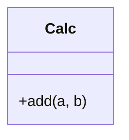
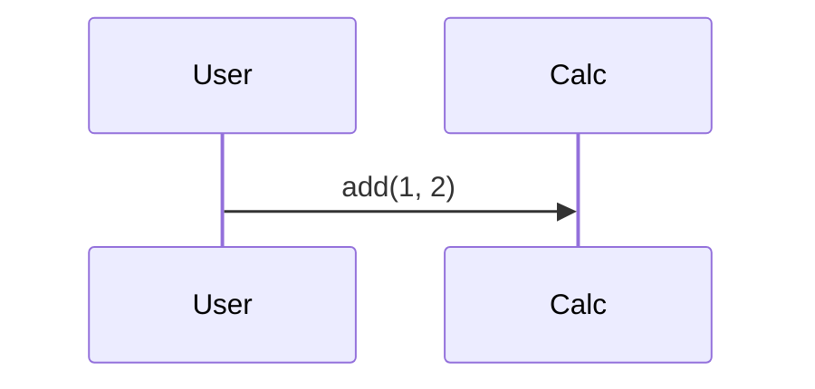

# DevEval Corpus Import (E-79) Implementation Plan

> **For agentic workers:** REQUIRED SUB-SKILL: Use superpowers:subagent-driven-development (recommended) or superpowers:executing-plans to implement this plan task-by-task. Steps use checkbox (`- [ ]`) syntax for tracking.

**Goal:** Convert the Python repositories of the CC BY 4.0 DevEval corpus into Kroker benchmark cases that grade through the existing held-out-oracle path, growing the corpus from 3 hand-authored cases to 3 + N external ones.

**Architecture:** A pure, offline converter reads each DevEval repository's `repo_config.json` manifest and emits a standard Kroker case directory (`case.yaml`, `oracle/`, `tasks.yaml`) plus three new sibling directories (`reference/`, `reference_artifacts/`, `reference_env/`) that E-80 and E-81 will consume later. Because DevEval oracles bind to exact module and function names, the generated `case.yaml` inlines the reference architecture as a frozen interface contract — the same pattern cat-café already uses. Cases whose oracles need live network are flagged and refused at matrix expansion until E-21.

**Tech Stack:** Python ≥3.11, pydantic v2, PyYAML, stdlib `json`/`ast`/`shutil`/`subprocess`, pytest (markers: `slow`).

## Global Constraints

- **No new runtime dependencies.** Everything uses stdlib plus `pydantic` and `pyyaml`, which are already in `pyproject.toml`.
- **Code lives in `src/`, data lives in `benchmarks/`.** The spec wrote the importer path as `benchmarks/importers/deveval.py`; that directory is a *data* tree (cases, `config.yaml`, `experiments/`). The importer therefore goes to `src/sdlc/benchmarks/importers/deveval.py`, matching every other benchmark module. Its *output* goes to `benchmarks/cases/`.
- **The importer fails loud.** A malformed `repo_config.json`, a missing declared path, or an unreadable file raises. This is the opposite discipline from the graders, and it is deliberate: the importer is offline, human-run, and one-shot (spec §7).
- **Never name anything `SC` or "structural completeness".** `benchmarks/sc_rollup.py` already means *Success Criteria* in this codebase (spec §2).
- **Every module starts with `from __future__ import annotations`** and a docstring that explains *why* the module exists, matching the surrounding files.
- **Line length ~79 columns**, matching existing benchmark modules. There is no committed ruff config; do not add one.
- **Test node-ids in `tasks.yaml` are oracle-dir-relative with forward slashes**, e.g. `unit_tests/test_check_date.py::test_within_range`. `grade_oracle` normalises pytest's `file` attribute by stripping the `oracle/` prefix and converting separators (`benchmarks/oracle.py:231`), so this exact shape is what matches.
- **Run tests with:** `pytest tests/<file> -v` for fast tests, `pytest -m slow tests/<file> -v` for slow ones. The default `addopts` excludes `slow`, `temporal`, and `docker`.
- **Out of scope for this plan:** E-80 (stage pinning) and E-81 (completeness/test-quality metrics). Do not add `pinned_stages`, functional completeness, stub density, or Oracle Test. `reference/`, `reference_artifacts/`, and `reference_env/` are *populated* here and *consumed* later.

## File Structure

| File | Responsibility |
|---|---|
| `src/sdlc/benchmarks/importers/__init__.py` | Package marker only |
| `src/sdlc/benchmarks/importers/deveval.py` | Manifest parsing, contract synthesis, task drafting, network detection, conversion orchestration |
| `src/sdlc/benchmarks/importers/verify.py` | The reference-passes-its-own-oracle gate |
| `src/sdlc/benchmarks/models.py` | +`CaseSpec.network_required` |
| `src/sdlc/benchmarks/matrix.py` | +`NetworkRequiredCaseError`, refusal at expansion |
| `src/sdlc/benchmarks/cli.py` | +`dispatch_import_deveval`, `dispatch_verify_case` |
| `src/sdlc/cli.py` | +`benchmark import-deveval`, `benchmark verify-case` parsers and dispatch |
| `tests/fixtures/deveval_mini/` | A miniature DevEval-shaped repository |
| `tests/test_deveval_importer.py` | Pure conversion tests |
| `tests/test_deveval_verify.py` | Self-check gate tests (`slow`) |
| `tests/test_benchmark_matrix.py` | +network-refusal tests |
| `benchmarks/cases/deveval-*/` | Generated output, committed in Task 9 |

---

### Task 1: `network_required` on `CaseSpec`, refused at matrix expansion

DevEval's `ArXiv_digest` oracle calls the live ArXiv API and `chakin` downloads word vectors. NFR-5 assumes the factory makes no egress beyond the declared research and OSV paths, so those cases must be un-runnable until E-21, not merely discouraged.

**Files:**
- Modify: `src/sdlc/benchmarks/models.py` (in `CaseSpec`, after the `language` field at line 161)
- Modify: `src/sdlc/benchmarks/matrix.py`
- Test: `tests/test_benchmark_matrix.py`

**Interfaces:**
- Consumes: nothing
- Produces: `CaseSpec.network_required: bool` (default `False`); `sdlc.benchmarks.matrix.NetworkRequiredCaseError(ValueError)`

- [ ] **Step 1: Write the failing tests**

Append to `tests/test_benchmark_matrix.py`:

```python
def test_network_required_case_is_refused_at_expansion():
    """NFR-5: a case whose oracle needs live egress must not run until the
    E-21 network tier exists. Refusal happens at expansion, alongside the
    ADR-6 judge check, so it lands before any cell starts."""
    spec = _spec(["zai-coding-plan/glm-5.2"]).model_copy(update={"network_required": True})
    with pytest.raises(NetworkRequiredCaseError):
        expand_matrix(spec)


def test_network_required_defaults_false_and_expands():
    spec = _spec(["zai-coding-plan/glm-5.2"])
    assert spec.network_required is False
    assert len(expand_matrix(spec)) == 2
```

Update the import at the top of the file:

```python
from sdlc.benchmarks.matrix import NetworkRequiredCaseError, SameFamilyJudgeError, expand_matrix
```

- [ ] **Step 2: Run the tests to verify they fail**

Run: `pytest tests/test_benchmark_matrix.py -v`
Expected: FAIL — `ImportError: cannot import name 'NetworkRequiredCaseError'`

- [ ] **Step 3: Add the field**

In `src/sdlc/benchmarks/models.py`, inside `CaseSpec`, directly after the `language: str | None = None` field:

```python
    # E-79: the case's held-out oracle needs live network (DevEval's
    # ArXiv_digest calls the ArXiv API; chakin downloads word vectors).
    # Refused at matrix expansion until the E-21 network tier exists --
    # NFR-5 assumes no egress beyond the declared research/OSV paths.
    network_required: bool = False
```

- [ ] **Step 4: Add the refusal**

In `src/sdlc/benchmarks/matrix.py`, add the error class after `SameFamilyJudgeError`:

```python
class NetworkRequiredCaseError(ValueError):
    pass
```

and make it the first check inside `expand_matrix`, before `arms = _arms_for(spec)`:

```python
if spec.network_required:
    raise NetworkRequiredCaseError(
        f"case {spec.case_id!r} declares network_required: its oracle "
        f"needs live egress, which NFR-5 forbids until the E-21 network "
        f"tier exists. The case is quarantined, not broken."
    )
```

- [ ] **Step 5: Run the tests to verify they pass**

Run: `pytest tests/test_benchmark_matrix.py -v`
Expected: PASS (all 10 tests)

- [ ] **Step 6: Commit**

```bash
git add src/sdlc/benchmarks/models.py src/sdlc/benchmarks/matrix.py tests/test_benchmark_matrix.py
git commit -m "feat(bench): quarantine network-requiring cases at matrix expansion (E-79)"
```

---

### Task 2: Parse `repo_config.json`

Every DevEval repository ships a manifest naming each artifact by path, so conversion is a manifest read rather than a scrape.

**Files:**
- Create: `src/sdlc/benchmarks/importers/__init__.py`
- Create: `src/sdlc/benchmarks/importers/deveval.py`
- Test: `tests/test_deveval_importer.py`

**Interfaces:**
- Consumes: nothing
- Produces: `RepoConfig` (pydantic model, fields `prd`, `uml_class`, `uml_sequence`, `architecture_design`, `dependencies`, `language`, `unit_tests`, `acceptance_tests`, `usage_examples`, `unit_test_linking`, `code_file_dag`); `load_repo_config(repo_dir: Path) -> RepoConfig`

- [ ] **Step 1: Write the failing test**

Create `tests/test_deveval_importer.py`:

```python
"""E-79: DevEval corpus conversion. Every test here is pure or tmp_path-
scoped -- the importer never touches the network."""

import json
from pathlib import Path

import pytest

from sdlc.benchmarks.importers.deveval import RepoConfig, load_repo_config

MANIFEST = {
    "PRD": "docs/PRD.md",
    "UML_class": "docs/UML_class.md",
    "UML_sequence": "docs/UML_sequence.md",
    "architecture_design": "docs/architecture_design.md",
    "dependencies": "docs/requirements.txt",
    "language": "python",
    "unit_tests": "unit_tests",
    "acceptance_tests": "acceptance_tests",
    "usage_examples": "examples",
    "unit_test_linking": {"unit_tests/test_a.py": ["mod.py"]},
    "code_file_DAG": {"mod.py": []},
    "incremental_development": False,
}


def test_load_repo_config_reads_every_declared_path(tmp_path):
    (tmp_path / "repo_config.json").write_text(json.dumps(MANIFEST), encoding="utf-8")
    cfg = load_repo_config(tmp_path)
    assert isinstance(cfg, RepoConfig)
    assert cfg.prd == "docs/PRD.md"
    assert cfg.uml_class == "docs/UML_class.md"
    assert cfg.architecture_design == "docs/architecture_design.md"
    assert cfg.language == "python"
    assert cfg.unit_test_linking == {"unit_tests/test_a.py": ["mod.py"]}
    assert cfg.code_file_dag == {"mod.py": []}


def test_load_repo_config_ignores_unknown_keys(tmp_path):
    """DevEval manifests carry prompt blobs we do not consume; extra keys
    must not break the import."""
    extra = dict(MANIFEST, coarse_unit_test_prompt={"x": "y"})
    (tmp_path / "repo_config.json").write_text(json.dumps(extra), encoding="utf-8")
    assert load_repo_config(tmp_path).language == "python"


def test_load_repo_config_raises_on_missing_manifest(tmp_path):
    """The importer fails loud -- it is offline, human-run, one-shot."""
    with pytest.raises(FileNotFoundError):
        load_repo_config(tmp_path)


def test_load_repo_config_raises_on_missing_required_key(tmp_path):
    broken = {k: v for k, v in MANIFEST.items() if k != "PRD"}
    (tmp_path / "repo_config.json").write_text(json.dumps(broken), encoding="utf-8")
    with pytest.raises(Exception):
        load_repo_config(tmp_path)
```

- [ ] **Step 2: Run the test to verify it fails**

Run: `pytest tests/test_deveval_importer.py -v`
Expected: FAIL — `ModuleNotFoundError: No module named 'sdlc.benchmarks.importers'`

- [ ] **Step 3: Write the implementation**

Create `src/sdlc/benchmarks/importers/__init__.py`:

```python
"""One-shot, offline converters that turn external benchmark corpora into
Kroker case directories. Import-time only -- nothing here runs during a
benchmark."""
```

Create `src/sdlc/benchmarks/importers/deveval.py`:

```python
"""DevEval (COLING 2025, CC BY 4.0) -> Kroker benchmark cases (E-79).

Every DevEval repository ships a repo_config.json naming each artifact by
path, so conversion is a manifest read rather than a scrape. This module is
pure where it can be and confines its I/O to convert_repo.

Fails loud on every error path: the importer is offline, human-run, and
one-shot, so a malformed manifest should stop it rather than silently emit
a half-built case (the opposite of the graders' fail-safe discipline).
"""

from __future__ import annotations

import json
from pathlib import Path

from pydantic import BaseModel, ConfigDict, Field


class RepoConfig(BaseModel):
    """The subset of repo_config.json the import consumes. Unknown keys
    (DevEval's per-test prompt blobs) are ignored on purpose."""

    model_config = ConfigDict(populate_by_name=True, extra="ignore")

    prd: str = Field(alias="PRD")
    uml_class: str = Field(alias="UML_class")
    uml_sequence: str = Field(alias="UML_sequence")
    architecture_design: str
    dependencies: str
    language: str
    unit_tests: str
    acceptance_tests: str
    usage_examples: str | None = None
    unit_test_linking: dict[str, list[str]] = Field(default_factory=dict)
    code_file_dag: dict[str, list[str]] = Field(default_factory=dict, alias="code_file_DAG")


def load_repo_config(repo_dir: Path) -> RepoConfig:
    """Read <repo_dir>/repo_config.json. Raises FileNotFoundError if absent
    and pydantic.ValidationError if a consumed key is missing."""
    path = Path(repo_dir) / "repo_config.json"
    if not path.is_file():
        raise FileNotFoundError(f"no repo_config.json in {repo_dir}")
    return RepoConfig(**json.loads(path.read_text(encoding="utf-8")))
```

- [ ] **Step 4: Run the test to verify it passes**

Run: `pytest tests/test_deveval_importer.py -v`
Expected: PASS (4 tests)

- [ ] **Step 5: Commit**

```bash
git add src/sdlc/benchmarks/importers/ tests/test_deveval_importer.py
git commit -m "feat(bench): parse DevEval repo_config.json manifests (E-79)"
```

---

### Task 3: Collect oracle test node-ids by AST

`tasks.yaml` entries must carry exact JUnit node-ids, so the importer has to know each test function's name. Parsing with `ast` avoids importing untrusted third-party test code.

**Files:**
- Modify: `src/sdlc/benchmarks/importers/deveval.py`
- Test: `tests/test_deveval_importer.py`

**Interfaces:**
- Consumes: nothing
- Produces: `collect_node_ids(test_root: Path, prefix: str) -> list[str]` — returns oracle-relative node-ids like `unit_tests/test_a.py::test_one`, sorted

- [ ] **Step 1: Write the failing test**

Append to `tests/test_deveval_importer.py`:

```python
from sdlc.benchmarks.importers.deveval import collect_node_ids

TEST_SRC = """
import unittest

def test_module_level():
    assert True

def helper_not_a_test():
    pass

class TestThing(unittest.TestCase):
    def test_method(self):
        assert True
    def setUp(self):
        pass
"""


def test_collect_node_ids_finds_functions_and_methods(tmp_path):
    d = tmp_path / "unit_tests"
    d.mkdir()
    (d / "test_a.py").write_text(TEST_SRC, encoding="utf-8")
    ids = collect_node_ids(d, "unit_tests")
    assert ids == ["unit_tests/test_a.py::test_method", "unit_tests/test_a.py::test_module_level"]


def test_collect_node_ids_skips_non_test_files(tmp_path):
    d = tmp_path / "unit_tests"
    d.mkdir()
    (d / "__init__.py").write_text("", encoding="utf-8")
    (d / "conftest.py").write_text("def test_nope(): pass", encoding="utf-8")
    (d / "test_a.py").write_text("def test_one(): pass", encoding="utf-8")
    assert collect_node_ids(d, "unit_tests") == ["unit_tests/test_a.py::test_one"]


def test_collect_node_ids_uses_forward_slashes(tmp_path):
    d = tmp_path / "unit_tests" / "sub"
    d.mkdir(parents=True)
    (d / "test_b.py").write_text("def test_two(): pass", encoding="utf-8")
    ids = collect_node_ids(tmp_path / "unit_tests", "unit_tests")
    assert ids == ["unit_tests/sub/test_b.py::test_two"]


def test_collect_node_ids_raises_on_unparseable_test(tmp_path):
    d = tmp_path / "unit_tests"
    d.mkdir()
    (d / "test_a.py").write_text("def test_(:\n", encoding="utf-8")
    with pytest.raises(SyntaxError):
        collect_node_ids(d, "unit_tests")
```

- [ ] **Step 2: Run the test to verify it fails**

Run: `pytest tests/test_deveval_importer.py -v`
Expected: FAIL — `ImportError: cannot import name 'collect_node_ids'`

- [ ] **Step 3: Write the implementation**

Add to `src/sdlc/benchmarks/importers/deveval.py` (add `import ast` to the imports):

```python
def collect_node_ids(test_root: Path, prefix: str) -> list[str]:
    """Every `test_*` function and method under test_root, as JUnit node-ids
    relative to the oracle dir: "<prefix>/<relpath>::<name>".

    Parsed with ast rather than imported: these are third-party test files
    and importing them would execute module-level code. The prefix/separator
    shape must match grade_oracle's normalization (oracle.py:231), which
    strips the "oracle/" prefix and converts to forward slashes.

    Raises SyntaxError on an unparseable test file -- fail loud.
    """
    root = Path(test_root)
    out: list[str] = []
    for path in sorted(root.rglob("test_*.py")):
        rel = path.relative_to(root).as_posix()
        tree = ast.parse(path.read_text(encoding="utf-8"), filename=str(path))
        names: list[str] = []
        for node in ast.walk(tree):
            if isinstance(node, (ast.FunctionDef, ast.AsyncFunctionDef)):
                if node.name.startswith("test_"):
                    names.append(node.name)
        out.extend(f"{prefix}/{rel}::{n}" for n in sorted(set(names)))
    return sorted(out)
```

- [ ] **Step 4: Run the test to verify it passes**

Run: `pytest tests/test_deveval_importer.py -v`
Expected: PASS (8 tests)

- [ ] **Step 5: Commit**

```bash
git add src/sdlc/benchmarks/importers/deveval.py tests/test_deveval_importer.py
git commit -m "feat(bench): collect oracle node-ids from DevEval tests by AST (E-79)"
```

---

### Task 4: Draft the `tasks.yaml` suite

`unit_test_linking` maps tests to *source files*, not to requirements, and PRD features are prose bullets with no identifiers. The importer therefore emits a **draft** at test-file granularity that a human confirms once per case (spec §3.4).

**Files:**
- Modify: `src/sdlc/benchmarks/importers/deveval.py`
- Test: `tests/test_deveval_importer.py`

**Interfaces:**
- Consumes: `collect_node_ids`
- Produces: `draft_task_suite(node_ids: list[str]) -> dict` returning `{"tasks": [{"id", "error_class", "oracle_tests"}, ...]}`; `render_tasks_yaml(suite: dict) -> str`

- [ ] **Step 1: Write the failing test**

Append to `tests/test_deveval_importer.py`:

```python
from sdlc.benchmarks.importers.deveval import draft_task_suite, render_tasks_yaml


def test_draft_task_suite_groups_by_test_file():
    ids = [
        "unit_tests/test_check_date.py::test_a",
        "unit_tests/test_check_date.py::test_b",
        "acceptance_tests/test_cli.py::test_c",
    ]
    suite = draft_task_suite(ids)
    assert suite["tasks"] == [
        {
            "id": "cli",
            "error_class": "functional",
            "oracle_tests": ["acceptance_tests/test_cli.py::test_c"],
        },
        {
            "id": "check_date",
            "error_class": "functional",
            "oracle_tests": [
                "unit_tests/test_check_date.py::test_a",
                "unit_tests/test_check_date.py::test_b",
            ],
        },
    ]


def test_draft_task_suite_ids_are_unique():
    """Same stem in two dirs must not collide -- TaskSuite rejects dupes."""
    ids = ["unit_tests/test_core.py::test_a", "acceptance_tests/test_core.py::test_b"]
    suite = draft_task_suite(ids)
    task_ids = [t["id"] for t in suite["tasks"]]
    assert len(task_ids) == len(set(task_ids))


def test_draft_task_suite_validates_against_the_real_loader(tmp_path):
    """The emitted draft must load through benchmarks.tasks.load_task_suite,
    or the case is dead on arrival."""
    from sdlc.benchmarks.tasks import load_task_suite

    ids = ["unit_tests/test_a.py::test_one"]
    case = tmp_path / "deveval-x"
    case.mkdir()
    (case / "tasks.yaml").write_text(render_tasks_yaml(draft_task_suite(ids)), encoding="utf-8")
    suite = load_task_suite("deveval-x", cases_dir=tmp_path)
    assert suite is not None
    assert suite.tasks[0].oracle_tests == ["unit_tests/test_a.py::test_one"]


def test_render_tasks_yaml_carries_a_review_banner():
    text = render_tasks_yaml(draft_task_suite(["unit_tests/test_a.py::test_one"]))
    assert "REVIEW" in text


def test_draft_task_suite_rejects_empty():
    with pytest.raises(ValueError):
        draft_task_suite([])
```

- [ ] **Step 2: Run the test to verify it fails**

Run: `pytest tests/test_deveval_importer.py -v`
Expected: FAIL — `ImportError: cannot import name 'draft_task_suite'`

- [ ] **Step 3: Write the implementation**

Add to `src/sdlc/benchmarks/importers/deveval.py` (add `import yaml` to the imports):

```python
DRAFT_BANNER = (
    "# DRAFT -- REVIEW BEFORE USE (E-79, spec 3.4).\n"
    "# Generated at test-FILE granularity from DevEval's unit_test_linking.\n"
    "# Functional completeness is requirement-weighted, so a human must\n"
    "# regroup these into real requirements and set each error_class.\n"
    "# Valid error_class values: functional, security, performance,\n"
    "# data_integrity, error_handling, api_contract.\n"
)


def _task_id(rel_file: str) -> str:
    """ "unit_tests/test_check_date.py" -> "check_date"; a directory prefix is
    kept only when it is needed to keep ids unique (TaskSuite rejects dupes)."""
    stem = Path(rel_file).stem
    return stem[len("test_") :] if stem.startswith("test_") else stem


def draft_task_suite(node_ids: list[str]) -> dict:
    """Group node-ids by test file into a draft tasks.yaml structure.

    Every task is emitted as error_class "functional" -- guessing a richer
    classification from a filename would produce confident, wrong error-class
    matrices. The human review pass sets these.
    """
    if not node_ids:
        raise ValueError("no oracle test node-ids; refusing to draft an empty task suite")
    by_file: dict[str, list[str]] = {}
    for nid in node_ids:
        by_file.setdefault(nid.split("::", 1)[0], []).append(nid)

    stems = [_task_id(f) for f in sorted(by_file)]
    collide = {s for s in stems if stems.count(s) > 1}

    tasks = []
    for rel_file in sorted(by_file):
        base = _task_id(rel_file)
        if base in collide:
            parent = Path(rel_file).parent.as_posix().replace("/", "-")
            base = f"{parent}-{base}" if parent not in ("", ".") else base
        tasks.append(
            {"id": base, "error_class": "functional", "oracle_tests": sorted(by_file[rel_file])}
        )
    return {"tasks": tasks}


def render_tasks_yaml(suite: dict) -> str:
    return DRAFT_BANNER + yaml.safe_dump(suite, sort_keys=False)
```

- [ ] **Step 4: Run the test to verify it passes**

Run: `pytest tests/test_deveval_importer.py -v`
Expected: PASS (13 tests)

- [ ] **Step 5: Commit**

```bash
git add src/sdlc/benchmarks/importers/deveval.py tests/test_deveval_importer.py
git commit -m "feat(bench): draft tasks.yaml from DevEval test files (E-79)"
```

---

### Task 5: Detect oracles that need live network

Conservative by design: a false positive quarantines a usable case, a false negative runs unsandboxed egress during a benchmark. Prefer the former.

**Files:**
- Modify: `src/sdlc/benchmarks/importers/deveval.py`
- Test: `tests/test_deveval_importer.py`

**Interfaces:**
- Consumes: nothing
- Produces: `detect_network(paths: list[Path]) -> tuple[bool, list[str]]` — `(required, evidence_lines)`

- [ ] **Step 1: Write the failing test**

Append to `tests/test_deveval_importer.py`:

```python
from sdlc.benchmarks.importers.deveval import detect_network


def test_detect_network_flags_urllib(tmp_path):
    p = tmp_path / "test_q.py"
    p.write_text("import urllib.request\nurllib.request.urlopen(u)\n", encoding="utf-8")
    required, evidence = detect_network([p])
    assert required is True
    assert any("urllib" in e for e in evidence)


def test_detect_network_flags_http_urls(tmp_path):
    p = tmp_path / "test_q.py"
    p.write_text('URL = "http://export.arxiv.org/api/query"\n', encoding="utf-8")
    required, _ = detect_network([p])
    assert required is True


def test_detect_network_clean_file(tmp_path):
    p = tmp_path / "test_q.py"
    p.write_text("def test_add():\n    assert 1 + 1 == 2\n", encoding="utf-8")
    assert detect_network([p]) == (False, [])


def test_detect_network_evidence_names_file_and_line(tmp_path):
    p = tmp_path / "test_q.py"
    p.write_text("x = 1\nimport requests\n", encoding="utf-8")
    _, evidence = detect_network([p])
    assert "test_q.py:2" in evidence[0]
```

- [ ] **Step 2: Run the test to verify it fails**

Run: `pytest tests/test_deveval_importer.py -v`
Expected: FAIL — `ImportError: cannot import name 'detect_network'`

- [ ] **Step 3: Write the implementation**

Add to `src/sdlc/benchmarks/importers/deveval.py` (add `import re`):

```python
# Deliberately over-broad. A false positive quarantines a usable case; a
# false negative lets a benchmark cell make live egress under NFR-5. The
# asymmetry justifies the noise.
_NETWORK_MARKERS = re.compile(
    r"\b(urllib|requests|httpx|aiohttp|socket|urlopen|wget|curl)\b"
    r"|https?://",
    re.IGNORECASE,
)


def detect_network(paths: list[Path]) -> tuple[bool, list[str]]:
    """Scan files for signs the code reaches the network.

    Returns (required, evidence) where each evidence line is
    "<name>:<lineno>: <stripped source line>". Scans only the files given --
    callers pass oracle tests and reference sources, never docs, whose prose
    URLs would flag every case.
    """
    evidence: list[str] = []
    for path in paths:
        try:
            text = Path(path).read_text(encoding="utf-8")
        except (OSError, UnicodeDecodeError):
            continue
        for i, line in enumerate(text.splitlines(), start=1):
            if _NETWORK_MARKERS.search(line):
                evidence.append(f"{Path(path).name}:{i}: {line.strip()}")
    return bool(evidence), evidence
```

- [ ] **Step 4: Run the test to verify it passes**

Run: `pytest tests/test_deveval_importer.py -v`
Expected: PASS (17 tests)

- [ ] **Step 5: Commit**

```bash
git add src/sdlc/benchmarks/importers/deveval.py tests/test_deveval_importer.py
git commit -m "feat(bench): detect network-requiring DevEval oracles (E-79)"
```

---

### Task 6: Synthesise the frozen interface contract and `case.yaml`

DevEval oracles import `readtime/result.py` and shell out to `python query_arxiv.py`, so a run that invents a different file tree scores zero on correct code. The generated description inlines the reference architecture as a frozen contract, exactly as cat-café freezes its `app:app` contract.

**Files:**
- Modify: `src/sdlc/benchmarks/importers/deveval.py`
- Test: `tests/test_deveval_importer.py`

**Interfaces:**
- Consumes: `RepoConfig`
- Produces: `case_id_for(repo_name: str) -> str`; `frozen_contract(architecture_md: str, uml_class_md: str) -> str`; `build_case_dict(*, case_id, prd, contract, language, judge_model, network_required, repo_url) -> dict`; `render_case_yaml(case: dict) -> str`

- [ ] **Step 1: Write the failing test**

Append to `tests/test_deveval_importer.py`:

```python
from sdlc.benchmarks.importers.deveval import (
    build_case_dict,
    case_id_for,
    frozen_contract,
    render_case_yaml,
)


def test_case_id_is_slugged_and_prefixed():
    assert case_id_for("ArXiv_digest") == "deveval-arxiv-digest"
    assert case_id_for("particle-swarm-optimization") == ("deveval-particle-swarm-optimization")


def test_frozen_contract_contains_both_artifacts_and_a_freeze_notice():
    c = frozen_contract("# Tree\n- mod.py\n", "```mermaid\nclassDiagram\n```")
    assert "mod.py" in c
    assert "classDiagram" in c
    assert "frozen" in c.lower()


def test_build_case_dict_matches_the_CaseSpec_contract():
    """The emitted dict must construct a CaseSpec, or `benchmark run` dies
    on a case the importer swore was valid."""
    case = build_case_dict(
        case_id="deveval-x",
        prd="# Introduction\nA tool.\n",
        contract="CONTRACT",
        language="python",
        judge_model="google:gemini-3.5-flash",
        network_required=False,
        repo_url="/srv/scratch-repos/deveval-x",
    )
    assert case["case_id"] == "deveval-x"
    assert case["language"] == "python"
    assert case["network_required"] is False
    assert "CONTRACT" in case["description"]
    assert "A tool." in case["description"]


def test_render_case_yaml_round_trips_through_load_case_spec(tmp_path):
    from sdlc.benchmarks.cli import load_case_spec

    case = build_case_dict(
        case_id="deveval-x",
        prd="# Introduction\nA tool.\n",
        contract="CONTRACT",
        language="python",
        judge_model="google:gemini-3.5-flash",
        network_required=True,
        repo_url="/srv/scratch-repos/deveval-x",
    )
    p = tmp_path / "case.yaml"
    p.write_text(render_case_yaml(case), encoding="utf-8")
    spec = load_case_spec(str(p))
    assert spec.case_id == "deveval-x"
    assert spec.network_required is True
    assert spec.language == "python"
    assert spec.judge_model == "google:gemini-3.5-flash"
```

- [ ] **Step 2: Run the test to verify it fails**

Run: `pytest tests/test_deveval_importer.py -v`
Expected: FAIL — `ImportError: cannot import name 'build_case_dict'`

- [ ] **Step 3: Write the implementation**

Add to `src/sdlc/benchmarks/importers/deveval.py`:

```python
CONTRACT_TEMPLATE = """\
Interface contract (frozen -- graded through it; not a functional
requirement, and it changes none of the requirements above). The held-out
oracle imports these modules and calls these functions by name, so the
produced repository MUST match this file tree and these class and function
names exactly. Anything not named here is your choice.

Architecture (file tree):
{architecture}

Class structure:
{uml_class}
"""


def case_id_for(repo_name: str) -> str:
    slug = re.sub(r"[^a-z0-9]+", "-", repo_name.lower()).strip("-")
    return f"deveval-{slug}"


def frozen_contract(architecture_md: str, uml_class_md: str) -> str:
    return CONTRACT_TEMPLATE.format(
        architecture=architecture_md.strip(), uml_class=uml_class_md.strip()
    )


def build_case_dict(
    *,
    case_id: str,
    prd: str,
    contract: str,
    language: str,
    judge_model: str,
    network_required: bool,
    repo_url: str,
) -> dict:
    """A CaseSpec-shaped dict. research_enabled is False: DevEval PRDs are
    already document-level, so a research stage would spend tokens
    re-deriving what the case already states."""
    summary = next(
        (ln.strip() for ln in prd.splitlines() if ln.strip() and not ln.startswith("#")),
        f"DevEval case {case_id}",
    )
    return {
        "case_id": case_id,
        "idea_summary": summary[:200],
        "description": f"{prd.strip()}\n\n{contract}",
        "mode": "greenfield",
        "language": language,
        "repo_url": repo_url,
        "research_enabled": False,
        "network_required": network_required,
        "harnesses": ["opencode"],
        "models": ["zai-coding-plan/glm-5.2"],
        "judge_model": judge_model,
        "rubrics": {},
    }


def render_case_yaml(case: dict) -> str:
    return (
        "# Generated by `sdlc benchmark import-deveval` (E-79).\n"
        "# Source: open-compass/DevEval, dataset CC BY 4.0.\n"
        "# See ATTRIBUTION.md in this directory.\n"
        + yaml.safe_dump(case, sort_keys=False, allow_unicode=True)
    )
```

- [ ] **Step 4: Run the test to verify it passes**

Run: `pytest tests/test_deveval_importer.py -v`
Expected: PASS (21 tests)

- [ ] **Step 5: Commit**

```bash
git add src/sdlc/benchmarks/importers/deveval.py tests/test_deveval_importer.py
git commit -m "feat(bench): synthesise frozen contract + case.yaml for DevEval cases (E-79)"
```

---

### Task 7: `convert_repo` — write the case directory

The orchestrator. All filesystem work for the import lives here; everything above it is pure.

**Files:**
- Modify: `src/sdlc/benchmarks/importers/deveval.py`
- Create: `tests/fixtures/deveval_mini/` (a miniature DevEval repository)
- Test: `tests/test_deveval_importer.py`

**Interfaces:**
- Consumes: everything from Tasks 2–6
- Produces: `ImportReport` (pydantic: `case_id`, `source_repo`, `network_required`, `network_evidence: list[str]`, `n_tasks`, `n_oracle_tests`, `reference_files: int`); `convert_repo(src: Path, dest_root: Path, *, judge_model: str) -> ImportReport`

- [ ] **Step 1: Build the fixture repository**

Create these files under `tests/fixtures/deveval_mini/`:

`repo_config.json`:
```json
{
  "PRD": "docs/PRD.md",
  "UML_class": "docs/UML_class.md",
  "UML_sequence": "docs/UML_sequence.md",
  "architecture_design": "docs/architecture_design.md",
  "dependencies": "docs/requirements.txt",
  "language": "python",
  "unit_tests": "unit_tests",
  "acceptance_tests": "acceptance_tests",
  "usage_examples": "examples",
  "unit_test_linking": {"unit_tests/test_calc.py": ["calc.py"]},
  "code_file_DAG": {"calc.py": []}
}
```

`docs/PRD.md`:
```markdown
# Introduction
A tiny calculator used only to exercise the DevEval importer.

# Features and Functionalities
- Addition of two integers via `add`.
```

`docs/UML_class.md`:
````markdown

````

`docs/UML_sequence.md`:
````markdown

````

`docs/architecture_design.md`:
```markdown
- calc.py
- unit_tests/test_calc.py
```

`docs/requirements.txt`:
```
pytest
```

`calc.py`:
```python
def add(a, b):
    return a + b
```

`unit_tests/test_calc.py`:
```python
from calc import add


def test_add_positive():
    assert add(1, 2) == 3


def test_add_negative():
    assert add(-1, -2) == -3
```

`acceptance_tests/test_cli.py`:
```python
from calc import add


def test_acceptance_add():
    assert add(2, 2) == 4
```

`examples/run.sh`:
```bash
python -c "from calc import add; print(add(1, 2))"
```

- [ ] **Step 2: Write the failing test**

Append to `tests/test_deveval_importer.py`:

```python
from sdlc.benchmarks.importers.deveval import ImportReport, convert_repo

FIXTURE = Path(__file__).resolve().parent / "fixtures" / "deveval_mini"


def _convert(tmp_path):
    return convert_repo(FIXTURE, tmp_path, judge_model="google:gemini-3.5-flash")


def test_convert_repo_writes_every_expected_path(tmp_path):
    report = _convert(tmp_path)
    case = tmp_path / "deveval-mini"
    assert isinstance(report, ImportReport)
    for rel in (
        "case.yaml",
        "tasks.yaml",
        "ATTRIBUTION.md",
        "oracle/unit_tests/test_calc.py",
        "oracle/acceptance_tests/test_cli.py",
        "reference/calc.py",
        "reference_artifacts/UML_class.md",
        "reference_artifacts/UML_sequence.md",
        "reference_artifacts/architecture_design.md",
        "reference_env/requirements.txt",
        "reference_env/examples/run.sh",
    ):
        assert (case / rel).is_file(), f"missing {rel}"


def test_convert_repo_keeps_docs_and_tests_out_of_reference(tmp_path):
    """reference/ is the gold implementation only -- shipping the oracle
    inside it would hand E-81 the answer key."""
    _convert(tmp_path)
    ref = tmp_path / "deveval-mini" / "reference"
    assert not (ref / "unit_tests").exists()
    assert not (ref / "acceptance_tests").exists()
    assert not (ref / "docs").exists()
    assert not (ref / "repo_config.json").exists()


def test_convert_repo_case_yaml_loads_and_tasks_validate(tmp_path):
    from sdlc.benchmarks.cli import load_case_spec
    from sdlc.benchmarks.tasks import load_task_suite

    _convert(tmp_path)
    spec = load_case_spec(str(tmp_path / "deveval-mini" / "case.yaml"))
    assert spec.case_id == "deveval-mini"
    suite = load_task_suite("deveval-mini", cases_dir=tmp_path)
    assert suite is not None
    assert {t.id for t in suite.tasks} == {"calc", "cli"}


def test_convert_repo_report_counts(tmp_path):
    report = _convert(tmp_path)
    assert report.case_id == "deveval-mini"
    assert report.n_tasks == 2
    assert report.n_oracle_tests == 3
    assert report.network_required is False
    assert report.reference_files == 1


def test_convert_repo_refuses_to_overwrite(tmp_path):
    _convert(tmp_path)
    with pytest.raises(FileExistsError):
        _convert(tmp_path)
```

- [ ] **Step 3: Run the test to verify it fails**

Run: `pytest tests/test_deveval_importer.py -v`
Expected: FAIL — `ImportError: cannot import name 'convert_repo'`

- [ ] **Step 4: Write the implementation**

Add to `src/sdlc/benchmarks/importers/deveval.py` (add `import shutil`):

```python
ATTRIBUTION = """\
# Attribution

This benchmark case is derived from **DevEval**.

> Bowen Li, Wenhan Wu, Ziwei Tang, Lin Shi, John Yang, Jinyang Li, Shunyu
> Yao, Chen Qian, Binyuan Hui, Qicheng Zhang, Zhiyin Yu, He Du, Ping Yang,
> Dahua Lin, Chao Peng, Kai Chen. "Prompting Large Language Models to Tackle
> the Full Software Development Lifecycle: A Case Study." COLING 2025,
> pages 7511-7531.

Source: https://github.com/open-compass/DevEval
Source repository: `benchmark_data/{language}/{repo_name}`
Dataset licence: CC BY 4.0 (https://creativecommons.org/licenses/by/4.0/)

Converted by `sdlc benchmark import-deveval` (E-79). The PRD, UML diagrams,
architecture design, reference implementation, and test suites are the
original authors' work, reorganised into this repository's case layout.
"""

# Never copied into reference/: docs are inputs, tests are the oracle, and
# DevEval's own scaffolding is not part of the gold implementation.
_REFERENCE_EXCLUDES = {
    "docs",
    "examples",
    "repo_config.json",
    "setup_shell_script.sh",
    "README.md",
    "__pycache__",
    ".git",
    ".gitignore",
}


class ImportReport(BaseModel):
    case_id: str
    source_repo: str
    network_required: bool
    network_evidence: list[str] = Field(default_factory=list)
    n_tasks: int
    n_oracle_tests: int
    reference_files: int


def _copy_tree(src: Path, dest: Path) -> None:
    shutil.copytree(src, dest, ignore=shutil.ignore_patterns("__pycache__", "*.pyc"))


def convert_repo(src: Path, dest_root: Path, *, judge_model: str) -> ImportReport:
    """Convert one DevEval repository into a Kroker case directory.

    Fails loud: a missing declared path, a malformed manifest, or an existing
    destination raises rather than emitting a half-built case.
    """
    src = Path(src)
    cfg = load_repo_config(src)
    repo_name = src.name
    case_id = case_id_for(repo_name)
    case_dir = Path(dest_root) / case_id
    if case_dir.exists():
        raise FileExistsError(f"{case_dir} already exists; delete it to re-import")

    unit_src = src / cfg.unit_tests
    accept_src = src / cfg.acceptance_tests
    for required in (
        src / cfg.prd,
        src / cfg.uml_class,
        src / cfg.uml_sequence,
        src / cfg.architecture_design,
        src / cfg.dependencies,
        unit_src,
        accept_src,
    ):
        if not required.exists():
            raise FileNotFoundError(f"{repo_name}: declared path missing: {required}")

    case_dir.mkdir(parents=True)

    # oracle/ -- both tiers, subdirs preserved so node-ids stay stable
    _copy_tree(unit_src, case_dir / "oracle" / cfg.unit_tests)
    _copy_tree(accept_src, case_dir / "oracle" / cfg.acceptance_tests)

    # reference_artifacts/ -- E-80's pinning input
    ra = case_dir / "reference_artifacts"
    ra.mkdir()
    for label, rel in (
        ("UML_class.md", cfg.uml_class),
        ("UML_sequence.md", cfg.uml_sequence),
        ("architecture_design.md", cfg.architecture_design),
    ):
        shutil.copyfile(src / rel, ra / label)

    # reference_env/ -- imported now, consumed by a future env-setup metric
    re_dir = case_dir / "reference_env"
    re_dir.mkdir()
    shutil.copyfile(src / cfg.dependencies, re_dir / "requirements.txt")
    if cfg.usage_examples and (src / cfg.usage_examples).is_dir():
        _copy_tree(src / cfg.usage_examples, re_dir / "examples")

    # reference/ -- E-81's gold implementation
    ref = case_dir / "reference"
    ref.mkdir()
    reference_files = 0
    skip = _REFERENCE_EXCLUDES | {cfg.unit_tests, cfg.acceptance_tests, cfg.usage_examples or ""}
    for entry in sorted(src.iterdir()):
        if entry.name in skip:
            continue
        if entry.is_dir():
            _copy_tree(entry, ref / entry.name)
            reference_files += sum(1 for _ in (ref / entry.name).rglob("*") if _.is_file())
        else:
            shutil.copyfile(entry, ref / entry.name)
            reference_files += 1

    node_ids = collect_node_ids(
        case_dir / "oracle" / cfg.unit_tests, cfg.unit_tests
    ) + collect_node_ids(case_dir / "oracle" / cfg.acceptance_tests, cfg.acceptance_tests)
    suite = draft_task_suite(sorted(node_ids))
    (case_dir / "tasks.yaml").write_text(render_tasks_yaml(suite), encoding="utf-8")

    scanned = sorted((case_dir / "oracle").rglob("*.py")) + sorted(ref.rglob("*.py"))
    network_required, evidence = detect_network(scanned)

    contract = frozen_contract(
        (ra / "architecture_design.md").read_text(encoding="utf-8"),
        (ra / "UML_class.md").read_text(encoding="utf-8"),
    )
    case = build_case_dict(
        case_id=case_id,
        prd=(src / cfg.prd).read_text(encoding="utf-8"),
        contract=contract,
        language=cfg.language,
        judge_model=judge_model,
        network_required=network_required,
        repo_url=f"/srv/scratch-repos/{case_id}",
    )
    (case_dir / "case.yaml").write_text(render_case_yaml(case), encoding="utf-8")
    (case_dir / "ATTRIBUTION.md").write_text(
        ATTRIBUTION.format(language=cfg.language, repo_name=repo_name), encoding="utf-8"
    )

    return ImportReport(
        case_id=case_id,
        source_repo=repo_name,
        network_required=network_required,
        network_evidence=evidence,
        n_tasks=len(suite["tasks"]),
        n_oracle_tests=len(node_ids),
        reference_files=reference_files,
    )
```

- [ ] **Step 5: Run the test to verify it passes**

Run: `pytest tests/test_deveval_importer.py -v`
Expected: PASS (26 tests)

- [ ] **Step 6: Commit**

```bash
git add src/sdlc/benchmarks/importers/deveval.py tests/test_deveval_importer.py tests/fixtures/deveval_mini/
git commit -m "feat(bench): convert a DevEval repo into a Kroker case dir (E-79)"
```

---

### Task 8: The reference-passes-its-own-oracle gate

If the gold implementation cannot pass the suite shipped with it, the case is broken. This single check catches the `ArXiv_digest` self-comparison bug class, network flakiness, and any path or import damage introduced by conversion (spec §7). It follows the shape already used by `tests/test_cat_cafe_oracle.py`.

**Files:**
- Create: `src/sdlc/benchmarks/importers/verify.py`
- Test: `tests/test_deveval_verify.py`

**Interfaces:**
- Consumes: a converted case directory
- Produces: `VerifyResult` (pydantic: `case_id`, `ok`, `returncode`, `output`); `verify_case(case_dir: Path, *, timeout_s: int = 600) -> VerifyResult`

- [ ] **Step 1: Write the failing test**

Create `tests/test_deveval_verify.py`:

```python
"""E-79 spec section 7: an imported case whose gold implementation cannot
pass its own oracle is broken, and must be caught at import rather than in a
benchmark run."""

from pathlib import Path

import pytest

from sdlc.benchmarks.importers.deveval import convert_repo
from sdlc.benchmarks.importers.verify import VerifyResult, verify_case

FIXTURE = Path(__file__).resolve().parent / "fixtures" / "deveval_mini"


@pytest.mark.slow
def test_verify_case_green_on_a_faithful_import(tmp_path):
    convert_repo(FIXTURE, tmp_path, judge_model="google:gemini-3.5-flash")
    result = verify_case(tmp_path / "deveval-mini")
    assert isinstance(result, VerifyResult)
    assert result.ok, result.output


@pytest.mark.slow
def test_verify_case_red_when_the_reference_is_broken(tmp_path):
    """The gate must discriminate, not merely run."""
    convert_repo(FIXTURE, tmp_path, judge_model="google:gemini-3.5-flash")
    calc = tmp_path / "deveval-mini" / "reference" / "calc.py"
    calc.write_text("def add(a, b):\n    return 0\n", encoding="utf-8")
    result = verify_case(tmp_path / "deveval-mini")
    assert not result.ok
    assert "test_add_positive" in result.output


@pytest.mark.slow
def test_verify_case_reports_a_missing_reference(tmp_path):
    convert_repo(FIXTURE, tmp_path, judge_model="google:gemini-3.5-flash")
    import shutil

    shutil.rmtree(tmp_path / "deveval-mini" / "reference")
    result = verify_case(tmp_path / "deveval-mini")
    assert not result.ok
    assert "reference" in result.output
```

- [ ] **Step 2: Run the test to verify it fails**

Run: `pytest -m slow tests/test_deveval_verify.py -v`
Expected: FAIL — `ModuleNotFoundError: No module named 'sdlc.benchmarks.importers.verify'`

- [ ] **Step 3: Write the implementation**

Create `src/sdlc/benchmarks/importers/verify.py`:

```python
"""The import-time gate: an imported case's oracle must pass against the
reference implementation shipped with it (E-79, spec section 7).

Mirrors the worktree shape grade_oracle builds -- reference sources at the
root, oracle/ copied in beside them, pytest run from the root -- minus git.
tests/test_cat_cafe_oracle.py uses the same shape for the hand-authored case.
"""

from __future__ import annotations

import shutil
import subprocess
import sys
import tempfile
from pathlib import Path

from pydantic import BaseModel


class VerifyResult(BaseModel):
    case_id: str
    ok: bool
    returncode: int
    output: str


def verify_case(case_dir: Path, *, timeout_s: int = 600) -> VerifyResult:
    """Run <case>/oracle against <case>/reference in a throwaway worktree."""
    case_dir = Path(case_dir)
    case_id = case_dir.name
    ref = case_dir / "reference"
    oracle = case_dir / "oracle"
    if not ref.is_dir():
        return VerifyResult(
            case_id=case_id, ok=False, returncode=-1, output=f"no reference/ dir in {case_dir}"
        )
    if not oracle.is_dir():
        return VerifyResult(
            case_id=case_id, ok=False, returncode=-1, output=f"no oracle/ dir in {case_dir}"
        )

    parent = tempfile.mkdtemp(prefix=f"verify-{case_id}-")
    try:
        wt = Path(parent) / "wt"
        shutil.copytree(ref, wt)
        shutil.copytree(oracle, wt / "oracle")
        proc = subprocess.run(
            [sys.executable, "-m", "pytest", "oracle", "-q", "-p", "no:cacheprovider"],
            cwd=wt,
            capture_output=True,
            text=True,
            timeout=timeout_s,
        )
        return VerifyResult(
            case_id=case_id,
            ok=proc.returncode == 0,
            returncode=proc.returncode,
            output=proc.stdout + proc.stderr,
        )
    except subprocess.TimeoutExpired:
        return VerifyResult(
            case_id=case_id, ok=False, returncode=-1, output=f"oracle timed out after {timeout_s}s"
        )
    finally:
        shutil.rmtree(parent, ignore_errors=True)
```

- [ ] **Step 4: Run the tests to verify they pass**

Run: `pytest -m slow tests/test_deveval_verify.py -v`
Expected: PASS (3 tests)

- [ ] **Step 5: Confirm the fast suite is unaffected**

Run: `pytest tests/test_deveval_importer.py tests/test_benchmark_matrix.py -v`
Expected: PASS

- [ ] **Step 6: Commit**

```bash
git add src/sdlc/benchmarks/importers/verify.py tests/test_deveval_verify.py
git commit -m "feat(bench): gate imports on reference passing its own oracle (E-79)"
```

---

### Task 9: CLI wiring

**Files:**
- Modify: `src/sdlc/benchmarks/cli.py`
- Modify: `src/sdlc/cli.py` (parser at lines 160–195; dispatch at lines 298–323; docstring at lines 1–22)
- Test: `tests/test_benchmark_cli.py`

**Interfaces:**
- Consumes: `convert_repo`, `verify_case`
- Produces: `dispatch_import_deveval(*, src: str, out: str | None = None, judge_model: str = "google:gemini-3.5-flash", repo: str | None = None) -> str`; `dispatch_verify_case(*, case: str, cases_root: str | None = None) -> str`

- [ ] **Step 1: Write the failing test**

Append to `tests/test_benchmark_cli.py`:

```python
def test_import_deveval_converts_every_repo_under_a_language_root(tmp_path):
    """The CLI walks benchmark_data/<language>/<repo> and reports per repo."""
    import shutil
    from pathlib import Path

    from sdlc.benchmarks.cli import dispatch_import_deveval

    fixture = Path(__file__).resolve().parent / "fixtures" / "deveval_mini"
    src_root = tmp_path / "src" / "python"
    src_root.mkdir(parents=True)
    shutil.copytree(fixture, src_root / "mini")
    out = tmp_path / "cases"
    out.mkdir()

    report = dispatch_import_deveval(src=str(src_root), out=str(out))
    assert "deveval-mini" in report
    assert (out / "deveval-mini" / "case.yaml").is_file()


def test_import_deveval_reports_network_quarantine(tmp_path):
    import shutil
    from pathlib import Path

    from sdlc.benchmarks.cli import dispatch_import_deveval

    fixture = Path(__file__).resolve().parent / "fixtures" / "deveval_mini"
    src_root = tmp_path / "src" / "python"
    src_root.mkdir(parents=True)
    shutil.copytree(fixture, src_root / "mini")
    (src_root / "mini" / "calc.py").write_text(
        "import requests\n\n\ndef add(a, b):\n    return a + b\n", encoding="utf-8"
    )
    out = tmp_path / "cases"
    out.mkdir()

    report = dispatch_import_deveval(src=str(src_root), out=str(out))
    assert "QUARANTINED" in report
```

- [ ] **Step 2: Run the test to verify it fails**

Run: `pytest tests/test_benchmark_cli.py -v`
Expected: FAIL — `ImportError: cannot import name 'dispatch_import_deveval'`

- [ ] **Step 3: Add the dispatchers**

Append to `src/sdlc/benchmarks/cli.py`:

```python
def dispatch_import_deveval(
    *,
    src: str,
    out: str | None = None,
    judge_model: str = "google:gemini-3.5-flash",
    repo: str | None = None,
) -> str:
    """Convert every repository under `src` (a DevEval
    benchmark_data/<language> directory) into a case directory under `out`.

    Fails loud on the first bad repository rather than importing a partial
    corpus -- see the importer's module docstring.
    """
    from .importers.deveval import convert_repo

    src_root = Path(src)
    dest = Path(out) if out else (Path(__file__).resolve().parents[3] / "benchmarks" / "cases")
    repos = [src_root / repo] if repo else [d for d in sorted(src_root.iterdir()) if d.is_dir()]
    if not repos:
        raise SystemExit(f"no repositories under {src_root}")

    lines: list[str] = []
    for d in repos:
        rep = convert_repo(d, dest, judge_model=judge_model)
        flag = " QUARANTINED (network_required)" if rep.network_required else ""
        lines.append(
            f"{rep.case_id}: {rep.n_tasks} draft tasks, "
            f"{rep.n_oracle_tests} oracle tests, "
            f"{rep.reference_files} reference files{flag}"
        )
        for e in rep.network_evidence[:5]:
            lines.append(f"    network: {e}")
    lines.append("")
    lines.append(
        "Next: review each tasks.yaml (drafts are test-file "
        "granularity), then run `sdlc benchmark verify-case "
        "--case <case_id>` for each."
    )
    return "\n".join(lines)


def dispatch_verify_case(*, case: str, cases_root: str | None = None) -> str:
    """Run one imported case's oracle against its own reference/."""
    from .importers.verify import verify_case

    root = (
        Path(cases_root)
        if cases_root
        else (Path(__file__).resolve().parents[3] / "benchmarks" / "cases")
    )
    result = verify_case(root / case)
    head = f"{result.case_id}: {'PASS' if result.ok else 'FAIL'}"
    return head if result.ok else f"{head}\n{result.output}"
```

- [ ] **Step 4: Run the test to verify it passes**

Run: `pytest tests/test_benchmark_cli.py -v`
Expected: PASS

- [ ] **Step 5: Wire the parser and dispatch**

In `src/sdlc/cli.py`, after the `bd = bsub.add_parser("drift")` line (line 168):

```python
bi = bsub.add_parser("import-deveval")
bi.add_argument("--src", required=True, help="a DevEval benchmark_data/<language> directory")
bi.add_argument("--repo", default=None, help="import only this repository (default: all)")
bi.add_argument("--out", default=None, help="destination cases dir (default: benchmarks/cases)")
bi.add_argument("--judge-model", default="google:gemini-3.5-flash", dest="judge_model")
bv = bsub.add_parser("verify-case")
bv.add_argument("--case", required=True, help="a case_id")
```

In the same file, inside `if args.cmd == "benchmark":`, before the `drift` branch (line 321):

```python
if args.bench_cmd == "import-deveval":
    from .benchmarks.cli import dispatch_import_deveval

    print(
        dispatch_import_deveval(
            src=args.src, out=args.out, repo=args.repo, judge_model=args.judge_model
        )
    )
    return
if args.bench_cmd == "verify-case":
    from .benchmarks.cli import dispatch_verify_case

    print(dispatch_verify_case(case=args.case))
    return
```

Add to the module docstring at the top of `src/sdlc/cli.py`, after the existing `benchmark` examples:

```
  python -m sdlc.cli benchmark import-deveval --src /path/DevEval/benchmark_data/python
  python -m sdlc.cli benchmark verify-case --case deveval-lice
```

- [ ] **Step 6: Verify the parser accepts the new verbs**

Run: `python -m sdlc.cli benchmark import-deveval --help`
Expected: usage text listing `--src`, `--repo`, `--out`, `--judge-model`

Run: `pytest tests/test_benchmark_cli.py -v`
Expected: PASS

- [ ] **Step 7: Commit**

```bash
git add src/sdlc/benchmarks/cli.py src/sdlc/cli.py tests/test_benchmark_cli.py
git commit -m "feat(bench): sdlc benchmark import-deveval / verify-case (E-79)"
```

---

### Task 10: Run the real import, vet the oracles, commit the corpus

This is the payload. It is the only task with human judgement in it, and the plan does not pretend otherwise: `tasks.yaml` drafts need regrouping and imported oracles need reading (spec §3.4, §3.5).

**Files:**
- Create: `benchmarks/cases/deveval-*/` (generated, reviewed, committed)
- Create: `docs/deveval-import-report-2026-08-09.md`
- Test: `tests/test_deveval_corpus.py`

**Interfaces:**
- Consumes: everything above
- Produces: the committed corpus and the recorded per-case verdict

- [ ] **Step 1: Clone DevEval at a pinned commit**

```bash
git clone https://github.com/open-compass/DevEval /tmp/DevEval
cd /tmp/DevEval && git rev-parse HEAD
```

Record the SHA — it goes in the import report. The tree read during design was `bb593c1f9c535ff0dde0c9f4807d58c9566c3a6c`.

- [ ] **Step 2: Import all ten Python repositories**

```bash
cd D:/own/Kroker
python -m sdlc.cli benchmark import-deveval --src /tmp/DevEval/benchmark_data/python
```

Expected: ten `deveval-*` lines. Note which are marked `QUARANTINED`. Do not commit yet.

- [ ] **Step 3: Verify each case against its own reference**

```bash
for c in benchmarks/cases/deveval-*/; do
  python -m sdlc.cli benchmark verify-case --case "$(basename "$c")"
done
```

Record PASS/FAIL per case with the failure output for each FAIL. Expect real failures: missing third-party dependencies, tests that assume a working directory, and the `ArXiv_digest` self-comparison defect.

- [ ] **Step 4: Triage every failure into one of three verdicts**

For each failing case, decide and write down which it is:
- **Fixable conversion defect** — a path or import broken by the import. Fix the importer, re-run, and add a regression test to `tests/test_deveval_importer.py`.
- **Upstream oracle defect** — the suite is wrong or vacuous, as in `ArXiv_digest`. Record it; do not silently repair the upstream author's test.
- **Environment requirement** — the oracle needs third-party packages. Record the requirement; `reference_env/requirements.txt` already carries it.

Delete any case that cannot reach a green verify. A red case in the corpus is worse than a missing one — it poisons every aggregate that includes it.

- [ ] **Step 5: Review each surviving `tasks.yaml`**

The drafts are test-file granularity with every `error_class` set to `functional`. For each surviving case: regroup entries so each task is a *requirement* from the PRD's "Features and Functionalities" section, and set each `error_class` to one of `functional`, `security`, `performance`, `data_integrity`, `error_handling`, `api_contract`. Delete the `# DRAFT -- REVIEW BEFORE USE` banner once done — its presence in a committed file means the review has not happened.

- [ ] **Step 6: Write the corpus regression test**

Create `tests/test_deveval_corpus.py`:

```python
"""Every committed DevEval case is structurally sound and reviewed (E-79)."""

from pathlib import Path

import pytest

from sdlc.benchmarks.cli import load_case_spec
from sdlc.benchmarks.tasks import load_task_suite

CASES = Path(__file__).resolve().parents[1] / "benchmarks" / "cases"
DEVEVAL = sorted(CASES.glob("deveval-*"))


def test_at_least_one_case_was_imported():
    assert DEVEVAL, "no deveval-* cases committed"


@pytest.mark.parametrize("case_dir", DEVEVAL, ids=lambda p: p.name)
def test_case_is_complete_and_reviewed(case_dir):
    spec = load_case_spec(str(case_dir / "case.yaml"))
    assert spec.case_id == case_dir.name
    assert spec.language == "python"
    for rel in (
        "oracle",
        "reference",
        "reference_artifacts",
        "reference_env",
        "ATTRIBUTION.md",
        "tasks.yaml",
    ):
        assert (case_dir / rel).exists(), f"{case_dir.name}: missing {rel}"

    tasks_text = (case_dir / "tasks.yaml").read_text(encoding="utf-8")
    assert "DRAFT -- REVIEW BEFORE USE" not in tasks_text, (
        f"{case_dir.name}: tasks.yaml is still an unreviewed draft"
    )

    suite = load_task_suite(case_dir.name, cases_dir=CASES)
    assert suite is not None and suite.tasks


@pytest.mark.parametrize("case_dir", DEVEVAL, ids=lambda p: p.name)
def test_reference_does_not_contain_the_oracle(case_dir):
    """reference/ is the gold implementation; shipping the oracle inside it
    would hand E-81's Oracle Test its own answer key."""
    ref = case_dir / "reference"
    assert not list(ref.rglob("test_*.py")), f"{case_dir.name}: oracle tests leaked into reference/"
```

- [ ] **Step 7: Run the full check**

Run: `pytest tests/test_deveval_corpus.py tests/test_deveval_importer.py tests/test_benchmark_matrix.py tests/test_benchmark_cli.py -v`
Expected: PASS

Run: `pytest -m slow tests/test_deveval_verify.py -v`
Expected: PASS

Run: `pytest`
Expected: PASS — the full fast suite, confirming nothing regressed.

- [ ] **Step 8: Write the import report**

Create `docs/deveval-import-report-2026-08-09.md` with: the pinned DevEval SHA; a table of all ten repositories with columns *case_id, verify verdict, network_required, n tasks, n oracle tests, notes*; every upstream oracle defect found in Step 4; and the final usable corpus count, which answers **OQ-B8**.

- [ ] **Step 9: Commit**

```bash
git add benchmarks/cases/deveval-* tests/test_deveval_corpus.py docs/deveval-import-report-2026-08-09.md
git commit -m "feat(bench): import the DevEval Python corpus as benchmark cases (E-79)

Answers OQ-B8 with a measured count. Quarantined cases carry
network_required and are refused at matrix expansion until E-21."
```

- [ ] **Step 10: Update the roadmap**

In `ROADMAP.md` §9.8, after the `E-39` entry, add an `E-79` item marked `[x]` with the usable corpus count and a pointer to both the spec and the import report. Add `OQ-B8` to `BENCHMARK.md` §7 with its answer. Leave `E-80` and `E-81` unlisted — they are separate plans.

```bash
git add ROADMAP.md BENCHMARK.md
git commit -m "docs: record E-79 landing and answer OQ-B8"
```

---

## Self-Review

**Spec coverage.** §3.1 manifest-driven conversion → Task 2. §3.2 frozen contract → Task 6. §3.3 the conversion table → Tasks 6–7 (`reference_env/` is populated in Task 7 and left unconsumed, as the spec states). §3.4 draft `tasks.yaml` plus human confirmation → Tasks 4 and 10 Step 5, enforced by the banner assertion. §3.4 oracle vetting → Task 10 Step 4. §3.5 network filter → Tasks 1, 5, and 10. §7 fail-loud importer → Tasks 2 and 7. §7 the reference-passes-its-own-oracle gate → Task 8, run for real in Task 10 Step 3. §9 `OQ-B8` → Task 10 Step 8. E-80 and E-81 correctly absent.

**Placeholder scan.** No TBD/TODO markers, and every code step carries runnable code. Task 10 is the only judgement-bearing task; its steps name the exact decision to make and the exact verdict to record rather than saying "review appropriately".

**Type consistency.** `RepoConfig.code_file_dag` is aliased to the JSON key `code_file_DAG` and referenced by the Python name everywhere. `collect_node_ids(test_root, prefix)` is called in Task 7 with the manifest's own `cfg.unit_tests` / `cfg.acceptance_tests` values as the prefix, which is what makes the emitted node-ids match `grade_oracle`'s normalisation. `draft_task_suite` returns `{"tasks": [...]}` and `render_tasks_yaml` consumes exactly that. `ImportReport` field names used in `dispatch_import_deveval` (`case_id`, `n_tasks`, `n_oracle_tests`, `reference_files`, `network_required`, `network_evidence`) all match the model. `VerifyResult.ok`/`.output` match their use in `dispatch_verify_case` and the tests. `load_task_suite(case_id, cases_dir=...)` matches the real signature at `benchmarks/tasks.py:76`.

One deviation from the spec, flagged in Global Constraints: the importer lives at `src/sdlc/benchmarks/importers/deveval.py`, not `benchmarks/importers/deveval.py`, because `benchmarks/` is a data tree in this repository.
