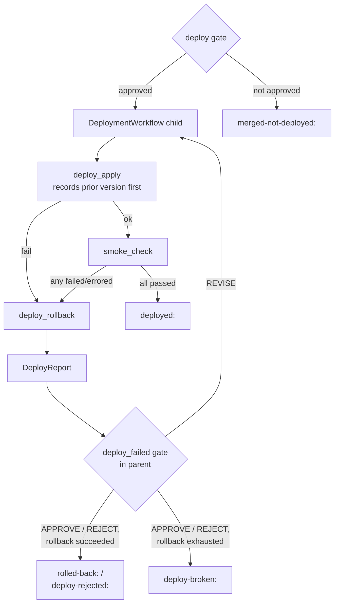

# Deploy contract — `DeployPlan` / `DeployReport` and a child `DeploymentWorkflow`

| | |
|---|---|
| Status | Design, approved 2026-08-06 |
| Date | 2026-08-06 |
| Closes | **E-67** (FR-1104), **E-68** (FR-1105, ADR-19) |
| Prepares | **E-70** (FR-1106) — the post-deploy observation loop attaches here |
| Related | `PRD.md` §FR-1104/FR-1105/NG7, `ROADMAP.md` §13, `ARCHITECTURE.md` §2–3 |

---

## 1. Problem

DAG stage 13 is a single hardcoded subprocess:

```python
await workflow.execute_activity(
    deploy,
    DeployInput(environment="staging", version=idea.title,
                command="make deploy ENV=staging", cwd=repo_path),
    **_long_act(cfg.roles.get("devops")),
)
self._status = "deployed"
return f"deployed:{pr_url}"
```
`src/sdlc/workflows/feature.py:2322-2329`, over `deploy` at `src/sdlc/activities.py:1039`.

Three things are wrong with it. There is **no plan** — nothing states what environment, flag, cohort or rollback this feature expects, so nothing can be reviewed or frozen. There is **no report** — the run claims `deployed:` on a zero exit code, with no evidence the deployed thing works. And there is **no rollback** — a bad deploy stays up, and the factory has already stopped looking.

`ROADMAP.md:129` records this as a known defect; `ROADMAP.md:1005` ranks E-67 fourth in the suggested ordering, noting it is needed by ordinary feature runs and not only by the product-outcome loop.

## 2. Scope

**In scope.** The `DeployPlan` / `DeployReport` contract; a deterministic child `DeploymentWorkflow` owning apply → smoke → rollback; a `deploy_failed` human gate in the parent; a pure `DeployAdapter` seam with `compose` (reference) and `script` (compatibility) implementations; tests.

**Out of scope, deliberately.** Feature-flag provider integration (NG7 — the flag is recorded and exported, never managed). Analytics sources (E-69). The observation window and keep/kill verdict (E-70) — but §5 names the exact seam it attaches to. Any hosting substrate of our own.

## 3. Design decisions

Recorded with the reasoning, because several were live forks during design.

**D-1 — The adapter is chosen by configuration, not by an agent.** FR-1105 says hosting targets are adapters resolved from config. So `DeployPlan` carries no adapter field; `PipelineConfig.deploy.adapter` does. The planner describes what a good deploy looks like; the operator decides what executes it.

**D-2 — The `DeployPlan` is authored at planning and frozen at the plan gate.** Same semantics as `ValidationContract.frozen` (`models.py:267`), and the same argument: smoke checks written *before* the code exists test the requirement, not the implementation. Environment, flag, cohort and rollback policy are requirements-level facts anyway. The cost is that a late architecture change can invalidate a plan; that is handled by the existing audited re-freeze gate round, not by new machinery.

**D-3 — Smoke results are tri-state, not boolean.** `passed` / `failed` / `errored`. "The adapter could not reach the service" is not a pass and is not the same as a failed assertion. This is E-40's malformed-SARIF-reads-as-clean hole in a new location, and it is closed here at the point of introduction rather than retrofitted. `errored` counts as failure for the rollback decision but is reported distinctly, so a human reads "we never found out" instead of "it was broken".

**D-4 — Auto-rollback is deterministic; the judgement call is human.** Smoke failure triggers an immediate rollback with no LLM, no gate and no waiting — the service is restored first. Only then does a `deploy_failed` gate open. Safety must not queue behind a human's inbox.

**D-5 — Deploy is a child workflow, not an inline stage.** The load-bearing reason is E-70: a post-deploy observation window is measured in days, and a 14-day timer inside `FeatureWorkflow` would pin the feature run open and inflate the history that every stage replays through. A child boundary now means B is a sibling workflow started at a seam that already exists. Secondary benefits: each retry attempt is its own child with its own history, and `feature.py` (~2300 lines) does not grow another stage body.

**D-6 — The gate stays in the parent.** All HITL machinery — `_gate`, `_pending`, `_wait_for_decision`, the signal handlers — lives on `FeatureWorkflow`, and Temporal signals are addressed to a workflow ID. Operators know their feature run's ID (`feature-add-sso`); they do not know a child's. Putting the gate in the child would mean duplicating that machinery or extracting a shared base — a large change to a large file, for no benefit this spec needs. The child is gate-free and returns a report; the parent gates on it.

**D-7 — Ship the `script` adapter alongside `compose`.** FR-1105 requires one reference adapter, and `compose` is it. But a seam with a single implementation ossifies into a substrate. `script` generalizes today's `make deploy` shell-out, costs almost nothing because the subprocess code already exists, keeps the seam honest, and preserves any target repo that already has a `make deploy` target.

**D-8 — No fake adapter; workflow tests mock activities instead.** Per-case benchmark config decides which cases deploy. The auto-rollback *sequencing* is covered by `@pytest.mark.temporal` tests with mocked activities; the compose adapter's *mechanics* are covered by one Docker-marked integration test. Nothing is stubbed in a shipped code path.

**D-9 — `deploy.enabled` defaults to `false`.** Nothing that exists today starts shelling out to Docker the day this lands.

## 4. Contracts

All in `src/sdlc/models.py` unless noted.

### 4.1 `DeployPlan`

Authored by `devops_planner` at the planning stage, frozen and hashed at the plan gate.

| Field | Type | Notes |
|---|---|---|
| `environment` | `str` | e.g. `"staging"` |
| `version` | `str` | release identity the adapter resolves to a tag |
| `flag` | `FeatureFlag \| None` | `name` + `cohort`; recorded and exported only (NG7) |
| `smoke_checks` | `list[SmokeCheck]` | deterministic, machine-checkable |
| `rollback` | `RollbackPolicy` | `auto: bool = True`, `to: Literal["previous"]` |
| `frozen` | `bool = True` | set at plan gate; immutable after |

No `adapter` field — see D-1.

### 4.2 `SmokeCheck`

Two kinds, both requirement-level so they survive being authored before any code exists:

- `http` — `path`, `expect_status`, `timeout_s`
- `command` — `command`, expects exit 0

A check may not reference an implementation detail the planner could not know at plan time. Ports and base URLs come from adapter config, not from the plan.

### 4.3 `SmokeCheckResult`

| Field | Type | Notes |
|---|---|---|
| `name` | `str` | |
| `state` | `Literal["passed", "failed", "errored"]` | D-3 |
| `detail` | `str` | `errored` and `failed` both require a non-empty detail |

Validator mirrors `Measurement._value_matches_state` (`src/sdlc/measurement.py:40`).

### 4.4 `DeployReport`

`deployed: bool`, `environment`, `version`, `adapter`, `endpoint`, `checks: list[SmokeCheckResult]`, `rolled_back: bool`, `rollback_reason: str`, `rolled_back_to: str | None`, `report_ref: ArtifactRef | None` (full adapter log via the existing claim-check store).

Consistency validator: `rolled_back=True` requires `rolled_back_to`; `deployed=False` requires either `rolled_back=True` or a `rollback_reason` explaining why not.

### 4.5 `PipelineConfig.deploy`

```
enabled: bool = False          # D-9
adapter: Literal["compose", "script"] = "compose"
base_url: str | None = None    # compose: endpoint for http smoke checks
commands: dict[str, str] = {}  # script: overrides for deploy/rollback/version
readiness_timeout_s: int = 60
```

## 5. Workflow structure

New file `src/sdlc/workflows/deployment.py`. `DeploymentWorkflow(DeploymentInput) -> DeployReport`, where `DeploymentInput` carries `plan`, `deploy_cfg`, `repo_path`, `run_id`, `attempt`.

**Invariant: the child contains no model call.** It joins `constitution`, the quality gate, and `summary/export` in ARCHITECTURE §2's "never LLM calls" row. The only agent involvement in stage 13 is `devops_planner` authoring the plan, back at planning time.



### 5.1 Activities

| Activity | Retry policy | Notes |
|---|---|---|
| `deploy_current_version` | 3 attempts | Read-only and idempotent, so retrying is free. Best-effort read of what is running now, BEFORE anything changes. |
| `deploy_apply` | 2 attempts | Long-running, heartbeating via the existing `_long_act` treatment — an image build takes minutes. Build failures are deterministic; the second attempt exists for registry/network blips. Refuses a plan with `frozen=False`. |
| `smoke_check` | 1 attempt | Polls for readiness within `readiness_timeout_s`, then runs each check exactly once. **Never raises on an assertion failure** — transport problems become `errored` results. Retrying here would mask the signal being collected; readiness polling is the activity's job, not the retry policy's. |
| `deploy_rollback` | 5 attempts, backoff | The safety operation. A failed rollback is the worst outcome in the system, so it is retried hardest. |

`deploy_current_version` is a **separate activity** running before `deploy_apply`, so the prior version lands in workflow state before anything changes. Folding it into `deploy_apply` would lose it whenever apply raises — which is exactly when §7 requires a rollback. A failed or empty probe returns `None` and is not an error; it means there is no rollback target.

### 5.2 Parent wiring

`FeatureWorkflow` replaces the `deploy` activity call with a child execution, deterministic ID `f"{run_id}-deploy-{attempt}"` so replay is stable and retry rounds are identifiable in the Temporal UI. The child carries a workflow execution timeout so a wedged build cannot hold the feature run open.

On `deployed=False` the parent opens a `deploy_failed` gate through the existing `_gate` helper, bounded by `MAX_GATE_ROUNDS`:

| `GateOutcome` | Meaning | Effect |
|---|---|---|
| `REVISE` + guidance | retry the deploy | new child, `attempt+1` |
| `APPROVE` | acknowledge, stop trying | `rolled-back:<pr_url>` |
| `REJECT` | terminal | `deploy-rejected:<pr_url>` |

**The gate opens even when rollback itself failed** — that is the case a human most needs to see. But `report.rolled_back` then overrides the outcome mapping: `APPROVE` and `REJECT` both return `deploy-broken:<pr_url>`, never `rolled-back:`, because nothing was in fact rolled back. `REVISE` still starts a retry child.

Gate expiry uses the existing `gate_timeout_hours` + `TimeoutAction`, defaulting to `REJECT` as everywhere except `merge`.

`GateContext` already carries `checks: list[CheckResult]` for the merge gate (`src/sdlc/pending.py:72`); smoke results map onto it rather than inventing a second render path.

### 5.3 Return values

| Value | Meaning |
|---|---|
| `deployed:<pr_url>` | applied, all smoke checks passed |
| `rolled-back:<pr_url>` | failed, rolled back, human acknowledged |
| `deploy-rejected:<pr_url>` | failed, rolled back, human rejected the run |
| `deploy-broken:<pr_url>` | **rollback itself failed** — live environment in unknown state |
| `merged-not-deployed:<pr_url>` | deploy gate not approved, or `deploy.enabled=false` (unchanged) |

`deploy-broken:` is deliberately distinct. Flattening it into an ordinary failure would hide the one outcome that needs a human immediately.

### 5.4 Where E-70 attaches

`DeploymentWorkflow` starts a sibling `ObservationWorkflow` with `ParentClosePolicy.ABANDON` immediately before returning its report. The observation run outlives the feature run, holds its own multi-day timer, and owns its own keep/kill/extend gate against its own workflow ID. Nothing in this spec builds it; this section exists so the seam is not accidentally designed shut.

## 6. Adapters

New package `src/sdlc/deploy/`, structurally a sibling of `toolchain/` and `harness/`: `adapters.py` (a `DeployKind` enum, the `DeployAdapter` ABC, both concrete adapters, and a module-level registry dict) plus `__init__.py` resolving from `PipelineConfig.deploy.adapter`.

**The adapter object is pure** — it produces command strings and identity, never runs a subprocess. Execution lives in activities. This follows `src/sdlc/toolchain/adapters.py` verbatim, which states the same rule for the same reason.

| Method | Returns |
|---|---|
| `apply_cmd(plan, repo)` | command bringing `plan.version` up |
| `current_version_cmd(plan)` | command whose stdout identifies the running version |
| `rollback_cmd(plan, to_version)` | command restoring a specific prior version |
| `endpoint(plan)` | base URL `http` smoke checks resolve against |
| `env(plan)` | `dict[str, str]` exported to every command |

**`ComposeAdapter`** (reference) — `apply_cmd` is `docker compose up -d --build` with the version as an image tag in `env`; `current_version_cmd` reads `docker compose images --format json`; `rollback_cmd` re-ups pinned to the prior tag. `endpoint` comes from `deploy.base_url` (default `http://localhost:<port>`), because the port is a deployment fact the planner cannot know at plan time.

**`ScriptAdapter`** (compatibility, D-7) — `make deploy` / `make rollback` / `make version`, overridable via `deploy.commands`, with `env(plan)` carrying `DEPLOY_ENV`, `DEPLOY_VERSION`, `DEPLOY_FLAG`, `DEPLOY_COHORT`.

**Smoke checks are adapter-independent.** The `smoke_check` activity resolves `http` checks against `adapter.endpoint(plan)` and runs `command` checks in the repo with `adapter.env(plan)` exported. This is what lets `SmokeCheck` stay a requirement-level assertion instead of something that has to know about Docker.

## 7. Failure modes

| Failure | Handling |
|---|---|
| `deploy_apply` fails | Two attempts, then roll back to the recorded prior version and gate. Rollback runs on apply failure too, not only smoke failure — a partially-applied compose stack is exactly why. |
| Smoke check fails | Assertion failure → rollback → gate. |
| Smoke check errors | Never a pass (D-3). Rollback → gate, reported distinctly. |
| Rollback fails | Retried with backoff. On exhaustion: `rolled_back: false` plus the exhaustion reason, the `deploy_failed` gate still opens, and the run returns `deploy-broken:` on any non-`REVISE` outcome (§5.2). |
| No prior version | First-ever deploy: nothing to restore. Report says so (`rollback_reason: "no previous version to restore"`), gate still opens. A first deploy that fails smoke leaves a broken service up; saying so plainly beats pretending otherwise. |
| Plan not frozen | `deploy_apply` refuses it. Cheap assertion, catches "someone edited the plan after the gate". |
| Plan drift | Checks referring to something never built `error` → rollback → gate, the correct conservative outcome. Re-freezing is the existing audited gate round. |
| Worker crash mid-deploy | Temporal replays (NFR-1). This is why sequencing lives in a workflow, not inside one large activity. |
| Hung deploy | Child workflow execution timeout. |
| `deploy_failed` gate expires | Existing `gate_timeout_hours` + `TimeoutAction`, default `REJECT`. |

## 8. Testing

**Unit — contracts.** `DeployPlan` freeze validation; `SmokeCheckResult` tri-state validator (an `errored` result must carry a detail); `DeployReport` consistency validator (§4.4).

**Unit — adapters.** The cheap, high-value layer, because adapters are pure: command-string generation for both adapters, `env(plan)` mapping including flag and cohort, `endpoint` resolution, and registry resolution from config. No subprocess, no Docker. Same shape as the existing toolchain adapter tests.

**Workflow — `@pytest.mark.temporal`, activities mocked.** Where the auto-rollback path earns its coverage without a shipped fake adapter (D-8):

1. all checks pass → `deployed:`
2. a check fails → rollback ran → gate → `APPROVE` → `rolled-back:`
3. a check **errors** → same rollback path — D-3 made executable, and the failure most deploy tooling passes silently
4. gate returns `REVISE` → second child with `attempt=2` → passes → `deployed:`
5. rollback exhausts retries → gate opens → `APPROVE` → `deploy-broken:`, **not** `rolled-back:`
6. `deploy.enabled=false` → no child started → `merged-not-deployed:`

**Integration — new `@pytest.mark.docker` marker**, added to the `addopts` exclusion list in `pyproject.toml:34` so the default run is unaffected. One test against a trivial FastAPI target in `tests/fixtures/`: real `compose up --build`, real HTTP smoke check, then a deliberately broken second version forcing a real rollback, asserting the prior container serves again afterward. This is the only test proving the compose adapter's rollback mechanics; everything above proves the sequencing around them.

**Benchmark.** One case opts in via `deploy.enabled`, taking a benchmark run through stage 13 for the first time.

## 9. Requirements closed

| ID | How |
|---|---|
| FR-1104 | `DeployPlan` / `DeployReport` split covering environment, flag, cohort, rollback, and smoke-tested deployment vs. PR merge (§4, §5.3) |
| FR-1105 | Adapters resolved from configuration, one reference adapter shipped, no hosting reimplemented (§6, D-1, D-7) |
| NG7 | Flag recorded and exported, never managed; no hosting or analytics substrate (§2) |
| ADR-19 | Deployment targets are adapters, not substrate (§6) |
| E-67 | Closes DAG stage 13 for all runs (§5) |
| E-68 | `compose` reference adapter plus `script` (§6) |
